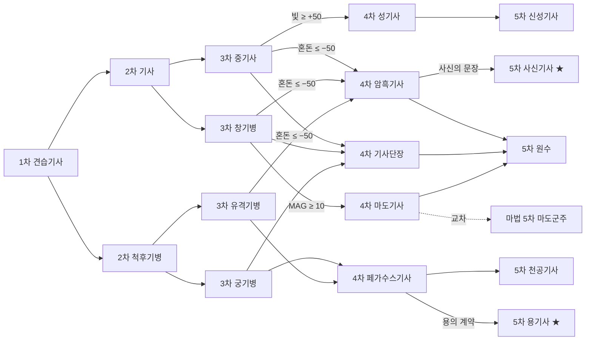
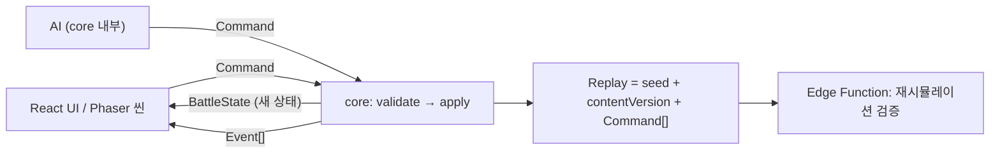

# 〈가칭: 오르덴 연대기〉 웹 SRPG 제작 계획서

> **보관용 v0.1 원안.** 현재 구현 기준은 [v0.2 제작 계획](docs/plan.md)과 연결된 상세 설계다. 아래 본문은 최초 아이디어를 보존하기 위해 유지하며, 범위·전투 수치·저장·일정·기술 관련 서술은 현행 결정으로 사용하지 않는다. 검토 결과는 [변경 기록](docs/design-review.md)을 참고한다.

| 항목 | 내용 |
|---|---|
| 문서 버전 | v0.1 (초안, 프리프로덕션 착수용) |
| 작성일 | 2026-09-08 |
| 작성 | 오현식 (기획·디렉팅) · Claude (정리·초안) |
| 상위 목표 | 랑그릿사 2의 지휘관·용병 전투와 전직 시스템을 뼈대로, **더 높은 난이도**와 **더 세분화된 전직**을 갖춘 오리지널 웹 SRPG를 1인 + AI 코딩 체제로 완성한다 |

**차례** — 0. 이 문서에 대해 · 1. 프로젝트 개요 · 2. 레퍼런스 분석 · 3. 게임 디자인 (3.1 핵심 루프 / 3.2 전투 규칙 / 3.3 유닛 체계 / 3.4 직업·전직 ★ / 3.5 난이도 ★ / 3.6 성장·경제 / 3.7 캠페인 / 3.8 화면·UX) · 4. 기술 계획 · 5. 아트·사운드 · 6. AI 협업 워크플로우 · 7. 로드맵 · 8. 리스크 · 9. 법적 고려사항 · 10. 다음 액션 · 부록 A 데이터 스키마 · 부록 B 용어집

---

## 0. 이 문서에 대해

이 문서는 게임의 범위, 핵심 규칙, 기술 구조, 일정, 리스크를 한 번에 정리한 최상위 계획서다. 이후에 만들어질 시스템별 상세 스펙(전투 규칙 스펙, 전직 데이터 시트, 챕터 스크립트 등)과 AI 코딩 도구에 넘길 작업 지시서는 모두 이 문서를 부모로 삼는다. 그래서 문서 자체를 저장소의 `docs/` 폴더에 넣고 코드와 함께 버전 관리하는 것을 전제로 썼다.

문서 안의 숫자(피해 공식 계수, 지휘 보정 %, 골드 배율 등)는 전부 **v0.1 초기값**이다. 정답이 아니라 "여기서부터 조정한다"는 기준점이며, 4장에서 설명하는 밸런싱 시뮬레이터로 검증한 뒤 바꾼다. 반면 1.3의 설계 원칙과 3장의 규칙 구조(무엇이 무엇에 영향을 주는가)는 바꾸려면 근거가 필요한 뼈대다.

한 줄 요약:

| 항목 | 내용 |
|---|---|
| 장르 | 지휘관·용병 기반 턴제 전략 RPG (SRPG) |
| 플랫폼 | 웹 브라우저 (데스크톱 우선, 태블릿·모바일 대응은 후순위) |
| 플레이 형태 | 싱글 캠페인 + 온라인 계정(클라우드 세이브·업적·랭킹). PvP 없음 |
| 개발 체제 | 1인 기획·디렉팅 + AI 코딩(Claude Code 등) |
| 핵심 차별점 | ① 5티어·약 100종의 세분화된 전직 트리 ② 난수가 아닌 설계(AI·경제·목표)로 만든 고난이도 ③ 결정론적 코어 기반 리플레이·랭킹 |
| 1차 목표(MVP) | 12장 캠페인, 5계열 + 군주 전직 1~3차(39종), 난이도 3종, 로컬 저장 — 약 5개월 |
| 2차 목표 | 온라인 계정, 전직 4~5차, 나머지 계열, 3루트 분기 |

---

## 1. 프로젝트 개요

### 1.1 컨셉

"한 명의 지휘관이 곧 한 부대다." 플레이어는 소수의 지휘관(영웅)을 이끌고, 각 지휘관은 전투마다 골드로 용병 부대를 고용해 격자 맵 위에서 싸운다. 지휘관의 지휘 범위 안에 있는 용병은 강해지고, 범위 밖의 용병은 약해지며, 지휘관이 쓰러지면 그 부대는 흩어진다. 성장의 축은 전직이다. 직업 레벨 10마다 갈림길이 나오고, 그 선택이 이동 방식, 고용할 수 있는 용병, 지휘 능력, 그리고 영구히 남는 계승 스킬을 바꾼다. 같은 캐릭터라도 어떤 길을 걸었느냐에 따라 전혀 다른 지휘관이 된다.

### 1.2 목표 플레이어

핵심층은 랑그릿사, 파이어 엠블렘, 택틱스 오우거 같은 고전 SRPG를 즐긴 30~40대다. 특히 최근 SRPG가 너무 쉬워졌다고 느끼는 층, 즉 실수가 비싸고 준비가 보상받는 게임을 원하는 사람을 정면으로 겨냥한다. 플레이 단위는 30~60분(한 장), 브라우저에서 바로 켜서 이어 하는 형태다.

### 1.3 설계 원칙 (모든 결정의 판단 기준)

1. **난이도는 난수가 아니라 설계에서 온다.** 적 AI의 판단력, 골드 압박, 다양한 승리 조건, 지형으로 압박한다. 운으로 지는 상황을 최소화한다.
2. **선택에는 대가와 흔적이 남는다.** 전직, 용병 편성, 루트 선택은 되돌릴 수 없고, 결과가 캐릭터에 남는다(계승 스킬, 성향).
3. **정보는 숨기지 않는다.** 피해 예측, 적의 이동·공격 범위, 전직 조건을 전부 보여준다. 어려운 것과 불친절한 것은 다르다.
4. **데이터가 게임을 만든다.** 직업, 유닛, 맵, 이벤트는 전부 데이터 파일이고 코드는 규칙 엔진이다. 콘텐츠 추가에 코드 수정이 필요하면 설계가 잘못된 것이다.
5. **작게 완성하고 넓힌다.** 1개 맵의 완성된 전투가 12개의 반쪽 시스템보다 낫다.

### 1.4 범위

| 포함 (MVP) | 포함 (2차) | 제외 |
|---|---|---|
| 싱글 캠페인 12장(단일 루트) | 3루트 분기, 24장 완전판 | PvP·실시간 멀티 |
| 지휘관 8명, 전직 1~3차(5계열 + 군주, 39종) | 지휘관 16명, 전직 4~5차, 도적 계열, 히든 직업(총 100종) | 가챠·과금 요소 |
| 난이도 3종, 협동형 적 AI | 주간 도전 맵(고정 시드) | 유저 제작 맵 공유 |
| 로컬 저장(브라우저) | 온라인 계정, 클라우드 세이브, 업적, 랭킹, 리플레이 검증 | 네이티브 앱 스토어 출시(추후 검토) |
| 데스크톱 브라우저 | 태블릿·모바일 터치 대응 | |

---

## 2. 레퍼런스 분석: 랑그릿사 2에서 무엇을 가져오고 무엇을 바꾸나

원작에서 가져오는 것은 "구조"이고, 바꾸는 것은 "깊이와 압박"이다. 아래 표는 설계 참고용이며, 실제 게임에는 원작의 명칭·캐릭터·아트·음악·시나리오를 일절 사용하지 않는다(9장).

| 요소 | 원작(랑그릿사 2 계열)의 구조 | 이 프로젝트 |
|---|---|---|
| 부대 구조 | 지휘관 + 고용 용병, 지휘 범위 안에서 보정 | 유지. 지휘 범위·보정치·용병 슬롯을 **직업 티어별로 차등화** |
| 전직 | 레벨 10 도달 시 분기, 3~4단계 | **5단계**, 단계마다 2~3갈래, 계열 교차·성향·아이템·스토리 조건, **계승 스킬 슬롯** |
| 유닛 상성 | 보병·창병·기병 삼각 + 궁병·비병·수병 | 유지 + 마법병·성직병·마물·언데드를 더해 **10종 상성 매트릭스** |
| 난이도 | 후반부는 레벨링으로 무난히 돌파 가능 | 자유 전투 제한, 골드 압박, 목표형 미션, 집중 공격 AI, 고난도 영구 사망 |
| 루트 분기 | 성향에 따른 다중 루트(후속작·리메이크 계열) | MVP는 단일 루트, 2차에서 3루트 |
| 전투 연출 | 병사 단위 애니메이션 | 유지하되 스킵·배속을 기본 제공 |
| 정보 제공 | 피해 예측 제한적 | 피해 예측·적 범위 표시·전직 조건 공개를 기본으로 |
| 저장 | 전투 중 자유 저장 | 난이도별 차등(3.5) |

원작의 재미의 핵심은 "지휘관을 어디에 세우느냐"가 용병 전체의 강함을 결정하고, "지휘관을 잃으면 부대가 사라진다"는 긴장에 있다. 이 두 가지는 규칙의 중심에 그대로 둔다. 바꾸는 부분은 그 긴장을 적 AI가 적극적으로 이용하게 만드는 것(범위 밖 용병 사냥, 지휘관 저격)과, 전직 선택이 지휘 범위·용병 구성 자체를 바꾸게 하여 "누구를 어떤 직업으로 키울지"가 전투 방식의 선택이 되게 하는 것이다.

---

## 3. 게임 디자인

### 3.1 핵심 루프

게임은 "장(챕터)" 단위로 진행된다. 한 장은 인터미션 → 전투 → 결과의 세 부분으로 이루어진다.

```
[인터미션]  대화·스토리 → 상점(장비·소모품) → 전직 → 출격 편성 → 용병 고용
     ↓
[전투]      초기 배치 → (아군 페이즈 → 적 페이즈 → 턴 종료 이벤트) 반복 → 승리 / 패배
     ↓
[결과]      EXP·골드·아이템 정산 → 스토리 → 다음 장
```

전투 안의 최소 루프는 "유닛 선택 → 이동 범위 확인 → 이동 → 행동 선택(공격·마법·스킬·아이템·대기) → 피해 예측 확인 → 확정 → 연출"이다. 플레이어가 매 턴 내리는 결정은 결국 두 가지로 압축된다. 지휘관을 어디에 세워 용병을 어디까지 커버할 것인가, 그리고 어느 적을 먼저 지울 것인가.

장 사이의 결정은 골드를 어디에 쓰느냐(용병 고용 vs 장비), 누구를 어느 직업으로 전직시키느냐, 이번 전투에 누구를 내보내느냐다. 난이도가 올라갈수록 이 결정의 여유가 줄어들도록 경제를 설계한다(3.5.3).

### 3.2 전투 규칙

**격자와 이동.** 정사각 타일 격자, 맵 크기는 20×15에서 32×24 사이. 4방향 이동(대각선 없음)이며, 이동력은 지형별 이동 비용을 차감하며 소모한다. 아군 유닛은 통과할 수 있고 적 유닛은 통과할 수 없다. 이동 후 행동(공격·마법·스킬·아이템·대기)을 하며, 행동 후에는 이동할 수 없다(일부 스킬 예외).

**턴 구조.** 아군 페이즈 → 적 페이즈 → (제3세력 페이즈) → 턴 종료 이벤트 판정. 페이즈당 각 유닛은 이동 1회 + 행동 1회. 턴 시작 시 거점 위 유닛 회복, 상태이상 판정, 증원 트리거 판정이 일어난다.

**유닛 HP.** 모든 유닛의 HP는 10이며 부대 규모를 뜻한다(병사 10명). 지휘관도 10이다. 강함은 HP가 아니라 공격(AT)·방어(DF)와 보정치로 표현한다. 이렇게 두면 "2번 맞으면 죽는다"는 직관이 모든 유닛에 동일하게 통하고, 피해 예측이 읽기 쉽다.

**공격과 반격.** 공격 → 반격(방어 측 사거리 안에 공격자가 있을 때) 순으로 1회씩. 근접 사거리 1, 궁병 2(장궁 2~3), 마법 1~3. 사거리 2 이상의 원거리 유닛은 인접한 적에게 반격하지 못한다(석궁 계열 예외). 이 규칙이 "궁병은 앞에 보병을 세워 지켜야 한다"는 진형의 필요를 만든다.

**지휘 시스템.** 지휘관의 지휘 범위(맨해튼 거리) 안에 있는 소속 용병은 지휘 보정(공격·방어 %)을 받는다. 범위 밖 용병은 보정 0. 지휘관이 쓰러지면 소속 용병은 그 즉시 퇴각(맵에서 제거)한다. 지휘 범위와 보정치는 직업 티어로 결정된다(3.4.4).

**지형.** 지형은 이동 비용과 방어 보정을 준다. 이동 타입(보행·기승·비행·수상·수륙)에 따라 비용이 다르며, 기병은 평지에서 강하고 숲·산에서 약하다는 원작의 감각을 유지한다.

| 지형 | 보행 | 기승 | 비행 | 수상 | 방어 보정 | 비고 |
|---|---|---|---|---|---|---|
| 평지 | 1 | 1 | 1 | ✕ | 0% | 기병 돌격 스킬 발동 가능 |
| 도로 | 1 | 1 | 1 | ✕ | −5% | 빠르지만 노출됨 |
| 숲 | 2 | 3 | 1 | ✕ | +15% | 사냥꾼·유격 계열은 비용 1 |
| 언덕 | 2 | 2 | 1 | ✕ | +10% | 궁병 계열 공격 +10% |
| 산 | 3 | ✕ | 1 | ✕ | +30% | 기승 진입 불가 |
| 늪 | 3 | ✕ | 1 | 2 | −15% | |
| 얕은 물(강) | 3 | ✕ | 1 | 1 | −20% | 수병 공격 +30%, 방어 +20% |
| 깊은 물(바다·호수) | ✕ | ✕ | 1 | 1 | 0% | 수상·비행만 진입 |
| 다리 | 1 | 1 | 1 | ✕ | 0% | 요충지 |
| 성벽·성문 | 1 | 1 | 1 | ✕ | +40% | 공성 계열은 이 보정을 무시 |
| 마을·거점 | 1 | 1 | 1 | ✕ | +20% | 턴 시작 시 HP +2, 점령 목표 |
| 폐허 | 2 | 2 | 1 | ✕ | +10% | 보물 배치 |

**피해 공식 (v0.1).** 1회 공격의 피해는 다음과 같이 계산한다.

```
실효공격 ATK' = AT × (1 + 지휘보정_공 + 지형보정_공 + 스킬보정_공) × 상성계수
실효방어 DEF' = DF × (1 + 지휘보정_방 + 지형보정_방 + 스킬보정_방)
부대규모보정  = 0.5 + 0.5 × (공격자 현재HP / 10)        // 병력이 줄면 화력도 준다
기본피해      = (ATK' − DEF') × 부대규모보정
피해          = clamp( round(기본피해) + 난수{−1, 0, +1}, 0, 10 )
최소 피해 규칙: ATK' ≥ DEF' × 0.6 이면 피해는 최소 1 (시뮬레이터로 재검토)
```

예시: 지휘 범위 안의 보병(AT 9, 보정 +10%)이 상성 우위(×1.3)인 창병(DF 7, 보정 +10%)을 공격하면 ATK' 12.9, DEF' 7.7, 기본피해 5.2 → 5 ± 1. 두 번 맞으면 죽는 감각이 나온다. 반대로 창병이 보병을 공격하면(×0.7) ATK' 6.9로 DEF'보다 낮아 0~1 피해에 그친다. 상성을 무시한 공격은 거의 의미가 없다는 것이 의도다.

**마법.** MP를 소모하며, 사거리 1~3, 범위는 단일·십자·3×3. 마법 피해는 지형 방어 보정을 무시하고 마법 저항(RES)만 적용한다: `피해 = clamp(round((위력 + MAG × 0.5 − RES) × 부대규모보정) + 난수, 0, 10)`. 마법에는 반격이 없다. 대신 시전자는 다음 적 페이즈에 노출된다.

**상태이상.** 독(턴 시작 시 HP −1, 3턴), 마비(1턴 행동 불가), 침묵(마법 불가, 2턴), 사기 저하(지휘 보정 무효, 2턴). 종류를 늘리지 않는다. 각각이 명확한 대응 수단(성직 계열 해제, 거점 회복)을 갖는다.

**승리·패배 조건.** 맵 스크립트로 정의하며, 한 맵에 주 목표 1개와 보너스 목표 0~2개를 둔다.

| 유형 | 설명 | 압박 방식 |
|---|---|---|
| 섬멸 | 적 전멸 | 증원, 턴 제한 |
| 보스 격파 | 특정 적 지휘관 격파 | 보스가 후방에서 지휘, 호위 부대 |
| 거점 점령 | 지정 타일을 지휘관이 점유한 채 턴 종료 | 성벽 보정, 역습 |
| N턴 방어 | 지정 지점·유닛을 N턴 지킴 | 파상 공격, 다방향 진입 |
| 호위 | NPC 유닛을 목적지까지 | NPC는 자동 이동, 비행 적의 우회 |
| 탈출 | 아군 전원(또는 지휘관)이 탈출 지점 도달 | 추격 부대, 시야 제한 |
| 특정 유닛 생존 | 지정 아군 사망 시 즉시 패배 | 적 AI가 그 유닛을 우선 목표로 |

패배 조건은 기본적으로 "주인공 사망"과 "턴 제한 초과"이며, 맵별로 추가된다.

**시야.** 기본은 전체 공개다. 시야 제한(안개)은 특정 맵에서만 쓰고, 그 맵에는 반드시 시야 확장 수단(추적자 계열, 횃불 아이템)이 존재하게 한다.

### 3.3 유닛 체계

**지휘관과 용병.** 이 둘은 규칙상 같은 유닛이지만 역할이 다르다.

| 구분 | 지휘관 | 용병 |
|---|---|---|
| 획득 | 스토리로 합류, 고정 캐릭터 | 인터미션에서 골드로 고용 |
| 성장 | 레벨·전직·장비·계승 스킬 | 없음(타입 고정 스탯). 생존 시 재계약 할인 |
| 스탯 | AT, DF, MAG, RES, MP, MOV, 지휘 범위, 지휘 보정 | AT, DF, RES, MOV, 사거리 |
| 사망 | 난이도별 규칙(3.5.5) | 소멸 |
| 지휘 | 소속 용병에 보정 | 지휘관 사망 시 퇴각 |

용병은 전투마다 고용하고, 전투가 끝나면 계약이 끝난다. 생존한 용병은 다음 전투에서 할인된 가격으로 "재계약"할 수 있다(난이도별 할인율 차등). 용병을 아끼는 플레이가 골드로 보상받는 구조다.

**용병 종류.** 10종. 각 지휘관 직업은 이 중 고용 가능한 종류가 정해져 있다(3.4).

| 용병 | 이동 | 사거리 | 기본 고용비 | 특징 |
|---|---|---|---|---|
| 보병 | 보행 4 | 1 | 100 | 기준 유닛. 창병에 강함 |
| 창병 | 보행 4 | 1 | 110 | 기병에 강함, 방어 높음 |
| 기병 | 기승 6 | 1 | 180 | 보병·궁병·마법병에 강함, 숲·산 취약 |
| 궁병 | 보행 4 | 2 | 130 | 비병에 강함, 근접 반격 불가 |
| 비병 | 비행 7 | 1 | 260 | 지형 무시, 궁병에 매우 약함 |
| 수병 | 수륙 5 | 1 | 150 | 물 위에서 강함, 육지에서 약함 |
| 마법병 | 보행 4 | 2 | 200 | 마법 공격(지형 방어 무시), 마물·비병에 강함 |
| 성직병 | 보행 4 | 1 | 170 | 언데드·마물에 강함, 인접 아군 소량 치유 |
| 마물 | 보행 5 | 1 | 220 | 공격 높음, 성직·마법에 약함. 조련·소환 계열만 고용 |
| 언데드 | 보행 3 | 1 | 90 | 싸고 물리 피해 −20%, 성직에 치명적으로 약함. 혼돈 계열만 고용 |

**상성 매트릭스.** 행이 공격자, 열이 방어자. ▲ = ×1.3, ▽ = ×0.7, ─ = ×1.0, ★ = ×1.5(특효), ▼ = ×0.5(특대 약점). 반격도 같은 표를 반격자 기준으로 적용하므로, 비병이 궁병을 공격하면 공격은 ▽로 약하고 궁병의 반격은 ▲로 강하다.

| 공격 → 방어 | 보병 | 창병 | 기병 | 궁병 | 비병 | 수병 | 마법병 | 성직병 | 마물 | 언데드 |
|---|---|---|---|---|---|---|---|---|---|---|
| 보병 | ─ | ▲ | ▽ | ─ | ─ | ─ | ─ | ─ | ─ | ─ |
| 창병 | ▽ | ─ | ▲ | ─ | ─ | ─ | ─ | ─ | ─ | ─ |
| 기병 | ▲ | ▽ | ─ | ▲ | ─ | ─ | ▲ | ▲ | ─ | ─ |
| 궁병 | ─ | ─ | ─ | ─ | ▲ | ─ | ─ | ─ | ─ | ─ |
| 비병 | ▲ | ─ | ▲ | ▽ | ─ | ─ | ▲ | ─ | ─ | ─ |
| 수병 | ─ | ─ | ─ | ─ | ─ | ─ | ─ | ─ | ─ | ─ |
| 마법병 | ─ | ─ | ▽ | ─ | ▲ | ─ | ─ | ─ | ▲ | ─ |
| 성직병 | ─ | ─ | ▽ | ▽ | ─ | ─ | ─ | ─ | ▲ | ★ |
| 마물 | ▲ | ─ | ─ | ▲ | ─ | ─ | ▽ | ▽ | ─ | ─ |
| 언데드 | ▲ | ─ | ─ | ─ | ─ | ─ | ─ | ▼ | ─ | ─ |

수병은 상성 대신 지형(얕은 물·바다)에서 힘을 얻고 육지에서 −20% 페널티를 받는다. 언데드는 물리 피해를 20% 덜 받는 대신 성직병의 공격과 성직 계열 마법에는 ×1.5로 무너지고, 스스로 성직병을 공격할 때는 ×0.5밖에 내지 못한다. 이 표의 계수(1.3 / 0.7 / 1.5 / 0.5)는 시뮬레이터 조정 대상이다.

### 3.4 직업·전직 시스템 ★ (핵심 차별점 1)

#### 3.4.1 구조 한눈에

직업은 6개 계열(전사·기사·궁수·마법사·성직자·도적)과 주인공 전용 계열(군주)로 나뉘고, 각 계열은 5티어로 깊어진다. 1차는 계열당 1개, 2차 2개, 3차 4개, 4차 4~5개, 5차 4~5개(히든 포함)로 총 약 100종이다. 같은 계열 안에서도 갈래마다 역할이 다르고, 티어가 오르면 계열 사이를 건너뛰는 교차 전직과 성향·아이템으로 열리는 히든 직업이 나타난다.

직업 하나가 결정하는 것은 다음 8가지다. 이 목록이 곧 직업 데이터의 스키마다(3.4.9).

| 항목 | 설명 | 플레이에 미치는 영향 |
|---|---|---|
| 이동 타입·이동력 | 보행 / 기승 / 비행 / 수륙, 3~8칸 | 갈 수 있는 지형, 진형 속도 |
| 지휘 범위·지휘 보정 | 티어 기본값 ± 직업 보정 | 용병을 얼마나 넓고 강하게 커버하는가 |
| 용병 슬롯·고용 가능 용병 | 4~7슬롯, 10종 중 2~4종 | 부대 구성 자체가 바뀜 |
| 스탯 성장률 | 레벨당 AT/DF/MAG/RES/MP 성장 | 같은 캐릭터라도 경로에 따라 스탯이 갈림 |
| 전직 보너스 | 전직 즉시 주요 스탯 +2 안팎 | 전직 타이밍의 보상 |
| 고유 스킬(액티브) | 직업에 있는 동안만 사용 | 돌격, 저격, 광역 마법, 은신 등 |
| 마스터리(패시브, 계승) | 그 직업 Lv10 달성 시 영구 획득 | 경로가 캐릭터에 남는 부분 |
| 전직 조건과 다음 직업 | 레벨·성향·스탯·아이템·스토리·기록 | 트리의 연결 |

#### 3.4.2 전직 규칙

- 직업 내 최대 레벨은 10이며, 레벨업에 필요한 EXP는 100으로 고정한다(획득 EXP 쪽에서 난이도 조절, 3.6).
- Lv10에 도달하면 인터미션에서 전직할 수 있다. 전투 중에는 불가. 전직하지 않으면 EXP를 더 얻을 수 없으므로 사실상 필수지만, "다음 장의 지형이 산이라 기승 전직을 한 장 미룬다" 같은 미루기 선택은 가능하다.
- 전직 후 레벨은 1이 되고 스탯은 유지된다. 전직 보너스가 즉시 붙는다.
- 전직은 취소할 수 없고, 하위 티어로 돌아갈 수 없다. 같은 티어의 다른 직업으로 옮기는 것도 불가하다.
- 마스터리는 해당 직업에서 Lv10을 찍었을 때 얻는다. 1차부터 4차까지 모두 Lv10을 찍으면 5차 도달 시 마스터리 4개를 갖게 되며, 장착 슬롯은 티어별로 제한된다(3.4.5). 경로가 달라지면 마스터리 조합이 달라지므로 같은 5차 직업이라도 캐릭터마다 다르다.
- 전직 조건은 전직 화면에서 전부 공개한다. 조건 미달인 직업도 회색으로 표시하고 무엇이 부족한지 보여준다(원칙 3).

#### 3.4.3 전직 조건의 종류

| 조건 유형 | 예시 | 용도 |
|---|---|---|
| 레벨 | Lv10 (필수, 모든 전직 공통) | 기본 게이트 |
| 성향 | 빛 ≥ +50 (성기사), 혼돈 ≤ −50 (암흑기사) | 루트·선택과 직업을 연결 |
| 스탯 문턱 | MAG ≥ 10 (마도기사), MOV 기본 6 이상 | 교차 전직의 자연스러운 조건 |
| 전직 아이템 | 흑요석 검(마검사), 용의 계약(용기사), 망자의 서(리치) | 히든 직업. 보물·보스 드롭·스토리 보상 |
| 스토리 플래그 | 특정 장에서 특정 인물을 살렸을 것 | 캐릭터 서사와 연결 |
| 전투 기록 | 비병 10기 처치(페가수스기사 조건 완화용 대체 조건) | 플레이 스타일 반영. 남용 금지, 대체 조건으로만 |

성향은 −100(혼돈)에서 +100(빛)까지의 게이지로, 스토리 선택(±10~30), 행동(마을 약탈 −5, 포로 석방 +5, 언데드 고용 전투당 −2), 루트 진입(고정값)으로 움직인다. 게이지는 항상 화면에서 확인할 수 있다.

#### 3.4.4 티어별 지휘 능력

지휘 범위와 보정은 티어가 기본값을 정하고, 직업이 가감한다. 지휘 특화 직업(전열대장, 기사단장, 마도지휘관, 군단장 등)은 범위 +1, 보정 +5%p, 슬롯 +1을 더 받는다. 개인 무력형 직업(광전사, 검호, 암흑기사 등)은 보정이 낮은 대신 자기 스탯이 높다.

| 티어 | 지휘 범위 | 지휘 보정(공/방) | 용병 슬롯 | 마스터리 장착 슬롯 | 10레벨 성장 총량(AT+DF+MAG+RES) |
|---|---|---|---|---|---|
| 1차 | 3 | +10% / +10% | 4 | 1 | +8 |
| 2차 | 3 | +15% / +15% | 5 | 2 | +10 |
| 3차 | 4 | +20% / +20% | 5 | 3 | +12 |
| 4차 | 4 | +25% / +25% | 6 | 3 | +14 |
| 5차 | 5 | +30% / +30% | 6 | 4 | +16 |

#### 3.4.5 마스터리(계승 스킬)

마스터리는 패시브이며 캐릭터에 영구 귀속된다. 장착 슬롯이 제한되므로 "무엇을 버릴 것인가"가 빌드다. 예시:

| 마스터리 | 출처 직업 | 효과 |
|---|---|---|
| 굳건함 | 전사 | 지형 방어 보정 +5%p |
| 돌격 본능 | 기사 | 3칸 이상 이동 후 공격 시 +10% |
| 숲의 걸음 | 사냥꾼 | 숲 이동 비용 1 |
| 마나 순환 | 마도사 | 턴 시작 시 MP +2 |
| 축복의 손 | 사제 | 인접 아군 턴 시작 시 HP +1 |
| 그림자 걸음 | 도적 | 이동 후 공격 시 반격 피해 −30% |
| 방패벽 | 철벽병 | 원거리 피해 −20% |
| 전장의 목소리 | 전열대장 | 지휘 범위 +1 |
| 야수 친화 | 조련사 | 마물 용병 고용비 −20% |
| 불굴 | 광전사 | 사망 피해를 받을 때 1회 HP 1로 생존(전투당 1회) |

#### 3.4.6 계열별 전직 트리

표 읽는 법: "다음 전직" 칸의 괄호는 조건(레벨 10은 생략), (H)는 히든 직업, "교차"는 다른 계열 직업으로 건너가는 경로다. 고용 용병은 그 직업이 인터미션에서 고용할 수 있는 종류이며, 수치(성장률·스킬 값)는 데이터 시트에서 관리한다.

**A. 전사 계열 — 근접 보병, 전열의 중심 (15종)**

| 티어 | 직업 | 역할·특징 | 이동 | 고용 용병 | 다음 전직 |
|---|---|---|---|---|---|
| 1 | 전사 | 균형형 근접. 어떤 지형에서도 무난 | 보행 4 | 보병·창병 | 검투사 / 호위병 |
| 2 | 검투사 | 공격 특화. 반격 피해 +20% | 보행 4 | 보병·창병 | 광전사 / 검객 |
| 2 | 호위병 | 방어 특화. 인접 아군 지휘관이 맞을 때 대신 막음(호위) | 보행 4 | 보병·창병·궁병 | 철벽병 / 전열대장 |
| 3 | 광전사 | HP 5 이하일 때 공격 +30%, 방어 −20% | 보행 5 | 보병·마물 | 워로드 / 검호 |
| 3 | 검객 | 치명타(×1.5) 15%, 회피 보정 | 보행 5 | 보병·창병 | 검호 / 워로드 |
| 3 | 철벽병 | 방어 특화, 원거리 피해 −20%, 이동 −1 | 보행 3 | 보병·창병·궁병 | 요새수호자 / 군단장 |
| 3 | 전열대장 | 지휘 특화. 범위 +1, 보병·창병 보정 +5%p | 보행 4 | 보병·창병·궁병 | 군단장 / 워로드 |
| 4 | 워로드 | 공격 + 지휘. 처치 시 인접 아군 공격 +10% (1턴) | 보행 5 | 보병·창병·마물 | 대장군 / 마검사(H) |
| 4 | 검호 | 개인 무력 정점. 지휘관 상대 피해 +20% | 보행 5 | 보병·창병 | 검성 / 마검사(H) |
| 4 | 요새수호자 | 성벽·거점 위 방어 +40%, 도발(적 AI 목표 유도) | 보행 3 | 보병·창병·궁병 | 요새군주 |
| 4 | 군단장 | 지휘 범위 5, 용병 슬롯 +1, 기병 고용 | 보행 4 | 보병·창병·궁병·기병 | 대장군 / 요새군주 |
| 5 | 대장군 | 지휘 최종. 보정 +35%, 범위 5, 슬롯 7 | 보행 4 | 보병·창병·궁병·기병 | — |
| 5 | 검성 | 무력 최종. 치명 25%, 공격 2회 | 보행 6 | 보병·창병 | — |
| 5 | 요새군주 | 방어 최종. 아군 전체 원거리 피해 −15%, 지형 보정 2배 | 보행 3 | 보병·창병·궁병·마법병 | — |
| 5 | 마검사 (H) | 혼돈 ≤ −50 + 흑요석 검. 물리와 마법을 모두 사용 | 보행 5 | 보병·마법병·마물 | — |

**B. 기사 계열 — 기병, 기동과 돌파 (17종)**

| 티어 | 직업 | 역할·특징 | 이동 | 고용 용병 | 다음 전직 |
|---|---|---|---|---|---|
| 1 | 견습기사 | 기동 근접. 평지에서 강하고 숲·산에서 약함 | 기승 6 | 기병·보병 | 기사 / 척후기병 |
| 2 | 기사 | 정통 기병. 돌격(3칸 이상 이동 후 공격 +15%) | 기승 6 | 기병·보병·창병 | 중기사 / 창기병 |
| 2 | 척후기병 | 이동 7, 보물·매복 발견, 방어 낮음 | 기승 7 | 기병·궁병 | 궁기병 / 유격기병 |
| 3 | 중기사 | 중갑. 방어 +, 이동 5 | 기승 5 | 기병·보병·창병 | 성기사(빛 ≥ +50) / 암흑기사(혼돈 ≤ −50) / 기사단장 |
| 3 | 창기병 | 대기병 특화(기병 상대 +30%) | 기승 6 | 기병·창병 | 기사단장 / 마도기사(MAG ≥ 10) / 암흑기사(혼돈 ≤ −50) |
| 3 | 궁기병 | 사거리 2 기병. 근접 반격 불가 | 기승 6 | 기병·궁병 | 페가수스기사 / 기사단장 |
| 3 | 유격기병 | 숲 이동 비용 1, 기습(선공 시 반격 피해 −50%) | 기승 7 | 기병·궁병·마물 | 페가수스기사 / 암흑기사(혼돈 ≤ −50) |
| 4 | 성기사 | 치유 마법(소), 언데드 특효, 성직병 고용 | 기승 5 | 기병·창병·성직병 | 신성기사 |
| 4 | 암흑기사 | 공격 시 피해의 절반만큼 HP 흡수. 지휘 보정 낮음 | 기승 6 | 기병·마물·언데드 | 사신기사(H) / 원수 |
| 4 | 기사단장 | 지휘 특화. 범위 5, 기병 보정 +10%p | 기승 6 | 기병·창병·보병·궁병 | 원수 |
| 4 | 페가수스기사 | 비행 전환. 지형 무시, 궁병에 약함 | 비행 7 | 비병·기병 | 천공기사 / 용기사(H) |
| 4 | 마도기사 | 교차(창기병 또는 전투마도사에서). 마법 쓰는 기병 | 기승 5 | 기병·마법병 | 원수 / 마도군주(교차, 마법 5차) |
| 5 | 신성기사 | 아군 전체 언데드·마물 피해 +20%, 부활(전투당 1회) | 기승 6 | 기병·창병·성직병 | — |
| 5 | 원수 | 기병 지휘 최종. 보정 +35%, 범위 5, 돌격 강화 | 기승 6 | 기병·창병·보병·궁병 | — |
| 5 | 천공기사 | 비행 최종. 궁병 약점 완화(×0.7 → ×0.85) | 비행 8 | 비병·기병 | — |
| 5 | 사신기사 (H) | 암흑기사 + 사신의 문장. 처치한 자리에 언데드 소환 | 기승 6 | 언데드·마물·기병 | — |
| 5 | 용기사 (H) | 페가수스기사 + 용의 계약(특정 장 이벤트) | 비행 7 | 비병·마물 | — |

기사 계열의 연결을 그림으로 보면 다음과 같다(★ = 히든).



**C. 궁수 계열 — 원거리, 정찰, 조련 (15종)**

| 티어 | 직업 | 역할·특징 | 이동 | 고용 용병 | 다음 전직 |
|---|---|---|---|---|---|
| 1 | 궁수 | 사거리 2. 근접 반격 불가 | 보행 4 | 궁병·보병 | 사냥꾼 / 장궁병 |
| 2 | 사냥꾼 | 숲·산 이동 비용 1, 마물 상대 +15% | 보행 5 | 궁병·보병 | 추적자 / 조련사 |
| 2 | 장궁병 | 사거리 2~3, 이동 3 | 보행 3 | 궁병·창병 | 저격수 / 석궁대장 |
| 3 | 추적자 | 은신 감지, 안개 맵 시야 +2, 기습 | 보행 5 | 궁병·보병 | 유격대장 / 명사수 |
| 3 | 조련사 | 마물 고용, 마물 보정 +10%p | 보행 5 | 마물·궁병 | 마수사 / 유격대장 |
| 3 | 저격수 | 사거리 3, 지휘관 저격 시 +20% | 보행 4 | 궁병 | 명사수 / 공성대장 |
| 3 | 석궁대장 | 대기병·대비병 +20%, 근접 반격 가능 | 보행 4 | 궁병·창병 | 공성대장 / 유격대장 |
| 4 | 유격대장 | 지휘 특화. 궁병·보병 용병에 숲 이동 보정 | 보행 5 | 궁병·보병·창병 | 숲의 군주 / 신궁 |
| 4 | 마수사 | 마물 슬롯 +1, 마물 보정 +20%p | 보행 5 | 마물·궁병 | 숲의 군주 / 야수왕(H) |
| 4 | 명사수 | 사거리 3, 치명 20%, 이동 후 사격 페널티 없음 | 보행 4 | 궁병 | 신궁 |
| 4 | 공성대장 | 성벽·거점 방어 보정 무시, 사거리 3 | 보행 3 | 궁병·창병·보병 | 공성사령관 |
| 5 | 숲의 군주 | 아군 전체 숲·산 이동 비용 1, 궁병·마물 보정 +35% | 보행 6 | 궁병·마물·보병 | — |
| 5 | 신궁 | 사거리 2~4, 지휘관 저격 +40% | 보행 5 | 궁병 | — |
| 5 | 공성사령관 | 거점 공략·방어 특화. 원거리 용병 보정 +35% | 보행 3 | 궁병·창병·보병 | — |
| 5 | 야수왕 (H) | 마수사 + 혼돈 ≤ −30 + 야수의 뿔. 마물 전용 3슬롯 추가 | 보행 6 | 마물·궁병 | — |

**D. 마법사 계열 — 마법, 소환, 사령 (15종)**

| 티어 | 직업 | 역할·특징 | 이동 | 고용 용병 | 다음 전직 |
|---|---|---|---|---|---|
| 1 | 견습마도사 | 마법 사거리 1~2. 물리 약함 | 보행 4 | 마법병·보병 | 마도사 / 소환사 |
| 2 | 마도사 | 원소 마법(화·빙·뇌), 사거리 2~3 | 보행 4 | 마법병·보병 | 원소술사 / 전투마도사 |
| 2 | 소환사 | 마물 고용, 정령 소환(1회용 유닛) | 보행 4 | 마물·마법병 | 정령술사 / 강령술사(혼돈 ≤ −30) |
| 3 | 원소술사 | 광역(3×3) 마법, 턴당 MP 회복 | 보행 4 | 마법병·보병 | 대마도사 / 마도지휘관 |
| 3 | 전투마도사 | 자가 강화(공·방 버프), 근접 반격 가능 | 보행 5 | 마법병·보병·창병 | 마도기사(교차, 기사 4차) / 대마도사 |
| 3 | 정령술사 | 정령 유닛 2종, 지형 마법(숲 생성·물 동결) | 보행 4 | 마물·마법병 | 대정령사 / 마도지휘관 |
| 3 | 강령술사 | 언데드 고용, 처치한 적 자리에 스켈레톤 생성 | 보행 4 | 언데드·마법병 | 사령술사 |
| 4 | 대마도사 | 십자 범위 3, 마법 위력 +30% | 보행 4 | 마법병·보병 | 현자(빛 ≥ +30) / 마도군주 |
| 4 | 마도지휘관 | 지휘 특화. 범위 5, 마법병 보정 +10%p | 보행 4 | 마법병·보병·창병·궁병 | 마도군주 |
| 4 | 대정령사 | 정령 상시 동행, 지형 마법 강화 | 보행 4 | 마물·마법병 | 정령왕의 계약자 |
| 4 | 사령술사 | 언데드 보정 +20%p, HP를 소모하는 강력 마법 | 보행 4 | 언데드·마물 | 리치(H) / 마도군주 |
| 5 | 현자 | 최고 위력 마법 + 치유. 아군 전체 RES +20% | 보행 4 | 마법병·성직병·보병 | — |
| 5 | 마도군주 | 마법 지휘 최종. 보정 +35%, 범위 5 | 보행 4 | 마법병·보병·창병·궁병 | — |
| 5 | 정령왕의 계약자 | 정령 유닛 3종, 지형 마법 광역 | 보행 5 | 마물·마법병 | — |
| 5 | 리치 (H) | 사령술사 + 혼돈 ≤ −70 + 망자의 서. 불사(전투당 1회 부활), 언데드 3슬롯 추가 | 보행 4 | 언데드·마물 | — |

**E. 성직자 계열 — 치유, 신성, 수도 (15종)**

| 티어 | 직업 | 역할·특징 | 이동 | 고용 용병 | 다음 전직 |
|---|---|---|---|---|---|
| 1 | 수도사 | 치유 마법, 언데드 특효, 물리 약함 | 보행 4 | 성직병·보병 | 사제 / 수도전사 |
| 2 | 사제 | 치유·버프 강화, 마법 방어 | 보행 4 | 성직병·보병 | 주교 / 성술사 |
| 2 | 수도전사 | 근접 가능, 자가 치유 | 보행 5 | 성직병·보병·창병 | 성전사 / 무승 |
| 3 | 주교 | 광역 치유, 상태이상 해제 | 보행 4 | 성직병·보병 | 대주교 / 심판관 |
| 3 | 성술사 | 신성 공격 마법. 마물·언데드 +50% | 보행 4 | 성직병·마법병 | 심판관 / 대주교 |
| 3 | 성전사 | 방어·근접, 성직병 보정 +10%p | 보행 5 | 성직병·보병·창병 | 성전기사 / 대주교 |
| 3 | 무승 | 이동 6, 회피, 반격 2회 | 보행 6 | 성직병·보병 | 각성무승 / 성전기사 |
| 4 | 대주교 | 부활(전투당 1회), 아군 전체 회복 | 보행 4 | 성직병·보병·궁병 | 성자(빛 ≥ +70) / 타락사제(H) |
| 4 | 심판관 | 신성 광역 마법, 혼돈 성향 적 +30% | 보행 4 | 성직병·마법병 | 대심판관 |
| 4 | 성전기사 | 기승 전환. 치유 + 근접, 범위 4 | 기승 6 | 성직병·기병·보병 | 성전군주 / 신성기사(교차, 기사 5차, 빛 ≥ +50) |
| 4 | 각성무승 | 이동 7, 적 마법 무효화 확률 30% | 보행 7 | 성직병·보병 | 대심판관 / 성전군주 |
| 5 | 성자 | 아군 전체 매 턴 HP +1, 부활 2회 | 보행 4 | 성직병·보병·궁병·마법병 | — |
| 5 | 대심판관 | 신성 공격 최종 | 보행 5 | 성직병·마법병·창병 | — |
| 5 | 성전군주 | 성직 지휘 최종(기승). 보정 +35% | 기승 6 | 성직병·기병·보병·창병 | — |
| 5 | 타락사제 (H) | 대주교 + 혼돈 ≤ −50 + 스토리 플래그. 치유가 흡수로 바뀜, 언데드 고용 | 보행 4 | 언데드·성직병 | — |

**F. 도적 계열 — 암살, 해상, 약탈 (15종)**

| 티어 | 직업 | 역할·특징 | 이동 | 고용 용병 | 다음 전직 |
|---|---|---|---|---|---|
| 1 | 도적 | 이동 5, 보물 발견, 자물쇠 해제, 방어 낮음 | 보행 5 | 보병·궁병 | 암살자 / 해적 |
| 2 | 암살자 | 치명 20%, 지휘관 직접 공격 +20%, 반격 회피 | 보행 6 | 보병·궁병 | 그림자 / 독술사 |
| 2 | 해적 | 수륙 이동, 수병 고용 | 수륙 5 | 수병·보병 | 선장 / 약탈자 |
| 3 | 그림자 | 은신(공격 전까지 적 AI 목표에서 제외) | 보행 6 | 보병·궁병 | 야행자 / 맹독대가 |
| 3 | 독술사 | 독 부여, 독 피해 2배 | 보행 5 | 보병·궁병·마물 | 맹독대가 / 야행자 |
| 3 | 선장 | 수병 보정 +15%p, 물 위 지휘 범위 +1 | 수륙 5 | 수병·보병·궁병 | 제독 / 약탈대장 |
| 3 | 약탈자 | 처치 시 골드 획득, 마을 약탈(혼돈 −5) | 보행 5 | 보병·마물·수병 | 약탈대장 / 제독 |
| 4 | 야행자 | 은신 강화, 안개 맵 보정, 암살(HP 3 이하 지휘관 즉사) | 보행 7 | 보병·궁병 | 그림자군주 / 의적왕 |
| 4 | 맹독대가 | 광역 독, 독 면역 | 보행 5 | 보병·궁병·마물 | 그림자군주 |
| 4 | 제독 | 수병 슬롯 +2, 해상 지휘 범위 5 | 수륙 6 | 수병·보병·궁병·창병 | 해적왕 / 유령선장(H) |
| 4 | 약탈대장 | 골드 획득 +, 사기 저하 부여 | 보행 5 | 보병·마물·수병 | 해적왕 / 의적왕 |
| 5 | 그림자군주 | 암살 최종. 용병도 은신 | 보행 7 | 보병·궁병·마물 | — |
| 5 | 해적왕 | 수상 최종. 육지 페널티 없음 | 수륙 6 | 수병·보병·궁병·창병 | — |
| 5 | 의적왕 | 도적 지휘 최종. 골드·사기 특화, 보정 +35% | 보행 6 | 보병·궁병·마물·수병 | — |
| 5 | 유령선장 (H) | 제독 + 혼돈 ≤ −50 + 저주받은 나침반. 언데드 수병 | 수륙 6 | 언데드·수병 | — |

**G. 주인공 전용 계열 — 군주 (8종)**

주인공은 1~2차를 군주 계열로 고정 진행하며(스토리상 영주의 후계), 3차부터 전사·기사 계열로 건너갈 수 있다. 5차 군주 직업은 루트에 따라 하나만 열린다. 군주 계열을 벗어난 주인공은 해당 계열의 5차 직업으로 끝난다. "왕이 되지 않는 주인공"도 정당한 선택이다.

| 티어 | 직업 | 역할·특징 | 이동 | 고용 용병 | 다음 전직 |
|---|---|---|---|---|---|
| 1 | 방랑검사 | 전사와 유사, 지휘 범위 3 | 보행 4 | 보병·창병 | 영주 |
| 2 | 영주 | 지휘 범위 4, 궁병 고용 | 보행 4 | 보병·창병·궁병 | 기사영주 / 검의 영주 |
| 3 | 기사영주 | 기승 전환, 기병 고용 | 기승 6 | 기병·보병·창병 | 대영주 / 성기사(교차, 기사 4차, 빛 ≥ +50) |
| 3 | 검의 영주 | 개인 무력, 검객 계열 스킬 | 보행 5 | 보병·창병·궁병 | 대영주 / 검호(교차, 전사 4차) |
| 4 | 대영주 | 지휘 범위 5, 모든 기본 용병 고용 | 기승 6 | 보병·창병·궁병·기병 | 국왕(왕국 루트) / 제국의 검(제국 루트) / 해방자(독립 루트) |
| 5 | 국왕 | 왕국 루트 최종. 지휘 보정 +40%, 성직병 고용 | 기승 6 | 보병·창병·궁병·기병·성직병 | — |
| 5 | 제국의 검 | 제국 루트 최종. 개인 무력 + 지휘, 비병 고용 | 기승 6 | 보병·창병·기병·비병 | — |
| 5 | 해방자 | 독립 루트 최종. 용병 고용비 −30%, 마물 고용 | 기승 6 | 보병·창병·궁병·기병·마물 | — |

계열별 합계: 전사 15, 기사 17, 궁수 15, 마법사 15, 성직자 15, 도적 15, 군주 8 = **100종**. MVP는 이 중 전사·기사·궁수·마법사·성직자 계열의 1~3차와 군주 1~3차, 총 39종을 구현하고, 나머지는 2차 목표에서 데이터 추가로 확장한다.

#### 3.4.7 교차 전직과 히든 직업

교차 전직은 한 계열의 3~4차 직업이 다른 계열의 상위 직업으로 이어지는 경로다. 트리를 격자처럼 얽히게 만들되, 경로 수를 6개 안팎으로 제한해 각 경로가 "그 캐릭터의 이야기"로 기억되게 한다.

| 출발 | 도착 | 조건 | 의미 |
|---|---|---|---|
| 창기병(기사 3차) | 마도기사(기사 4차) | MAG ≥ 10 | 마법 재능 있는 기사 |
| 전투마도사(마법 3차) | 마도기사(기사 4차) | 없음 | 말에 오른 마법사 |
| 마도기사(기사 4차) | 마도군주(마법 5차) | 없음 | 기사에서 마법 지휘관으로 |
| 성전기사(성직 4차) | 신성기사(기사 5차) | 빛 ≥ +50 | 교단의 기사 |
| 기사영주(군주 3차) | 성기사(기사 4차) | 빛 ≥ +50 | 왕이 아닌 성기사의 길 |
| 검의 영주(군주 3차) | 검호(전사 4차) | 없음 | 왕이 아닌 검의 길 |

히든 직업은 각 계열의 5차에 하나씩(기사만 둘) 두고, 성향 + 전직 아이템(+ 일부 스토리 플래그)으로 연다. 전직 아이템은 보물, 보스 드롭, 특정 장의 선택 보상으로 얻는다. 아이템 위치는 도감에 "획득 가능 장"만 힌트로 공개한다.

| 히든 직업 | 계열 | 조건 요약 |
|---|---|---|
| 마검사 | 전사 | 혼돈 ≤ −50, 흑요석 검 |
| 사신기사 | 기사 | 암흑기사, 사신의 문장 |
| 용기사 | 기사 | 페가수스기사, 용의 계약(특정 장 이벤트) |
| 야수왕 | 궁수 | 마수사, 혼돈 ≤ −30, 야수의 뿔 |
| 리치 | 마법사 | 사령술사, 혼돈 ≤ −70, 망자의 서 |
| 타락사제 | 성직자 | 대주교, 혼돈 ≤ −50, 스토리 플래그 |
| 유령선장 | 도적 | 제독, 혼돈 ≤ −50, 저주받은 나침반 |

히든 직업이 전부 혼돈 쪽에 몰려 있는 것은 의도다. 빛 쪽의 보상은 히든이 아니라 정규 5차 직업(신성기사·현자·성자)의 조건으로 넣어, 빛 루트는 "정도(正道)의 완성", 혼돈 루트는 "숨겨진 힘"이라는 대비를 만든다.

#### 3.4.8 캐릭터와 계열

지휘관 캐릭터는 각자 시작 직업(보통 계열 1차, 후반 합류 캐릭터는 2~3차)을 갖고 그 계열의 트리를 따른다. 같은 계열의 두 캐릭터는 트리는 같지만 성장률 개성(예: 한 명은 AT 성장 +20%, 다른 한 명은 DF), 고유 스킬 1개(직업과 무관), 초기 성향, 스토리 플래그가 다르다. MVP 지휘관 8명은 주인공(군주) 1, 전사 2, 기사 2, 궁수 1, 마법사 1, 성직자 1로 구성한다. 완전판 16명에서 도적 계열과 후반 합류 캐릭터(4차로 합류하는 적 지휘관 출신 등)를 더한다.

#### 3.4.9 데이터 정의 예시

직업 하나는 아래와 같은 JSON 한 덩어리다. 코드는 이 구조를 해석할 뿐 직업 이름을 알지 못한다(원칙 4). 전체 스키마는 부록 A.

```json
{
  "id": "knight_paladin",
  "name": "성기사",
  "line": "knight",
  "tier": 4,
  "moveType": "mounted",
  "move": 5,
  "command": { "range": 4, "atkBonus": 0.25, "defBonus": 0.25, "mercSlots": 6 },
  "hireable": ["cavalry", "pikeman", "cleric"],
  "growth": { "AT": 1.2, "DF": 1.3, "MAG": 0.6, "RES": 0.8, "MP": 1.0 },
  "promotionBonus": { "DF": 2, "MAG": 1 },
  "skills": ["heal_lesser", "holy_strike"],
  "mastery": "aura_of_faith",
  "requirements": { "level": 10, "alignmentMin": 50 },
  "next": ["knight_holy_champion"],
  "visual": { "spriteGroup": "mounted_heavy", "palette": "tier4" }
}
```

### 3.5 난이도 설계 ★ (핵심 차별점 2)

난이도는 다섯 개의 레버로 만든다. 적 AI의 판단력, 경제 압박, 목표의 다양성, 사망 규칙, 그리고 저장 제한이다. 적 스탯 배율은 마지막에 미세 조정용으로만 쓴다. 스탯만 올린 난이도는 "같은 게임을 더 오래 하는 것"이지 더 어려운 게임이 아니기 때문이다.

#### 3.5.1 난이도 모드

기본 선택은 "어려움"이다. "일반"은 원작 수준의 난이도를 기준점으로 삼고, "악몽"은 설계자가 의도한 모든 압박을 켠 상태다. 모드는 캠페인 시작 시 고르고, 진행 중에는 낮추는 것만 허용한다(낮추면 랭킹·업적 일부 비활성).

| 레버 | 일반 | 어려움 (기본) | 악몽 |
|---|---|---|---|
| 적 스탯 배율 | 100% | 110% | 120% |
| 적 지휘관 직업 | 기준 | 기준 + 스킬 추가 | 1티어 상향 (3차 → 4차) |
| 적 AI 프로필 | 개별 판단 | 협동(집중 공격, 범위 밖 용병 우선) | 협동 + 지휘관 저격 + 지형 점유 + 증원 강화 |
| 골드 수입 | 100% | 75% | 55% |
| 생존 용병 재계약 | 무료 | 50% | 전액(재계약 개념 없음) |
| 자유 전투 | 장당 무제한 | 장당 1회 | 없음 |
| 지휘관 사망 | 다음 장 복귀 | 2개 장 부상(결장) + 치료비 | 영구 이탈 |
| 전투 중 저장 | 자유 | 턴 시작 시 1슬롯(덮어쓰기) | 없음. 전투 단위 저장만 |
| 턴 제한 | 일부 맵, 여유 | 대부분 맵, 여유 | 전 맵, 빠듯 |
| 피해 난수 | ±1 | ±1 | ±1 |
| 피해 예측·적 범위 표시 | 표시 | 표시 | 표시 |

마지막 두 줄이 이 설계의 핵심이다. 난수와 정보 제공은 난이도에 따라 바꾸지 않는다. 악몽에서 지는 이유는 언제나 "내가 잘못 판단했다"여야 한다.

#### 3.5.2 적 AI 설계

적 AI는 효용(utility) 기반으로 만든다. 매 적 페이즈에 다음 순서로 판단한다.

1. **전장 평가.** 아군·적군의 위협 맵(각 칸에서 다음 턴 받을 수 있는 최대 피해), 목표 진행도, 각 지휘관의 지휘 범위 커버리지를 계산한다.
2. **지휘관 단위 계획.** 각 적 지휘관은 성격 프로필(공격적·신중·기회주의·수비·광신)과 맵 스크립트가 준 명령(N턴까지 대기 후 돌격, 거점 사수, 특정 유닛 추격 등)을 결합해 이번 턴의 의도를 정한다. 프로필은 후퇴 기준(HP ≤ 3이면 치유 쪽으로), 위험 감수도, 목표 가중치를 바꾼다.
3. **유닛 단위 행동 후보 생성.** 이동 가능한 모든 칸 × 그 칸에서 가능한 행동을 후보로 만든다.
4. **효용 점수.** 예상 피해, 처치 확률, 예상 반격 피해, 다음 턴 피격 위험(위협 맵), 목표까지의 거리 변화, 자기 지휘관의 범위 안에 머무는지, 지형 가치, 목표 우선순위 가중치를 합산한다.
5. **실행과 조율.** 최고 점수를 실행하고 결과를 반영한 뒤 다음 유닛으로 넘어간다. 같은 지휘관 소속 유닛은 "목표 보드"를 공유해 집중 공격이 자연스럽게 나온다.

목표 우선순위(어려움 이상)는 다음 순서를 기본으로 하고 프로필로 가중치를 조정한다: 이번 턴에 처치 가능한 유닛 > 지휘 범위 밖에 있는 용병 > 치유·마법 유닛 > 처치 가능성이 있는 지휘관 > 상성 우위 대상 > 나머지. 지휘관 저격(악몽)은 "지휘관을 잡으면 소속 용병이 전부 사라진다"는 규칙을 적이 적극적으로 노리는 것이다. 플레이어가 지휘관을 전열에 세우는 순간 그 리스크를 감당하게 된다.

AI가 "읽히는" 것도 중요하다. 성격 프로필과 스크립트 명령은 도감이나 정찰(추적자 계열)로 확인할 수 있게 하여, 고수는 패턴을 읽고 대비하는 재미를 얻게 한다. 그리고 AI 판단은 코어 패키지의 순수 함수로 구현되어 시드가 같으면 결과가 같다. 그래야 테스트할 수 있고, 리플레이가 성립한다(4.2).

#### 3.5.3 경제 압박

골드는 전투 보상(맵별 고정) + 보너스 목표(턴 이내 클리어, 아군 무손실, 보물) + 약탈로 들어오고, 용병 고용, 장비, 소모품, 부상 치료비(어려움 이상), 일부 전직 아이템 구매로 나간다. 난이도별 수입 배율을 적용하면 어려움에서는 "모든 지휘관을 풀 슬롯으로 내보내는" 것이 불가능해지도록 맞춘다. 목표는 매 전투 전에 "누구를 비워서 내보낼 것인가, 어떤 용병을 빼야 하는가"를 고민하게 만드는 것이다. 무손실 보너스와 재계약 할인이 있으므로 잘하는 플레이어는 여유가 생기고, 소모전을 하는 플레이어는 점점 궁해진다. 이 곡선은 시뮬레이터로 잡는다(3.5.7).

#### 3.5.4 목표 다양화와 맵 설계 원칙

12장 중 순수 섬멸은 3장을 넘기지 않는다(3.7 표). 맵 설계는 다음 원칙을 따른다. 초크포인트가 있되 우회로(비행·수상)가 반드시 하나 있어서 진형만으로 해결되지 않게 한다. 증원은 턴이 아니라 플레이어의 위치·행동으로 트리거해서 "그냥 기다리기"가 정답이 되지 않게 한다. 보너스 목표는 주 목표와 긴장 관계(빨리 클리어 vs 보물 회수)에 있게 한다. 적 지휘관의 위치는 그 지휘관의 성격을 드러내야 한다(신중형은 뒤에서 지휘, 광신형은 앞에서 돌격).

#### 3.5.5 사망·부상 규칙

지휘관이 쓰러지면 소속 용병이 퇴각하는 것은 모든 난이도 공통이다. 지휘관 본인의 운명은 난이도에 따라 다르다. 어려움의 "부상"은 다음 2개 장에 출격할 수 없고 치료비를 내야 한다는 뜻으로, 영구 사망의 공포 없이 "이 캐릭터 없이 두 장을 버텨야 한다"는 압박을 만든다. 악몽의 영구 이탈은 스토리상 그 캐릭터의 대사가 대체 인물로 넘어가는 처리를 포함한다(대체 대사 비용은 콘텐츠 리스크로 8장에 반영). 주인공 사망은 모든 난이도에서 즉시 패배다.

#### 3.5.6 공정성 장치

어려운 게임이 불친절한 게임이 되지 않도록 다음을 기본 제공한다. 공격 전 피해 예측(피해 범위, 반격 피해, 처치 확률), 적 유닛 클릭 시 이동+공격 범위 표시, 모든 적 범위 겹쳐 보기, 지휘 범위 표시 토글, 턴 되돌리기 없음(대신 이동 확정 전 취소는 자유), 전투 로그, 전직 조건 전면 공개, 도감의 상성표·지형표 상시 열람. 그리고 연출 스킵·배속·자동 진행을 기본 제공한다.

#### 3.5.7 밸런싱 방법

밸런싱은 감이 아니라 도구로 한다. 코어 패키지가 렌더링과 분리되어 있으므로(4.2) 헤드리스로 전투를 수천 번 돌릴 수 있다. 시뮬레이터에 넣을 시나리오는 세 종류다. 첫째, 상성·지형 단위 미시 시뮬레이션(보병 vs 창병 in 숲 1,000회 → 평균 피해·승률). 둘째, 맵 단위 AI vs 스크립트 플레이어(기본 전략 봇) 시뮬레이션으로 난이도별 승률·평균 턴·손실을 본다. 셋째, 캠페인 경제 시뮬레이션(장별 수입·지출 곡선). 지표 목표치는 어려움 기준으로 "숙련 플레이어 첫 클리어율 40~60%, 평균 재도전 1~2회"로 두고, 베타 텔레메트리(4.4)로 실측과 비교한다.

### 3.6 성장·경제

**EXP.** 레벨업 필요 EXP는 100 고정. 처치 EXP = 30 × 레벨차 보정(적 레벨 − 아군 레벨 1당 ±10%, 0.3~2.0 범위). 피해 EXP = 피해량 × 2. 용병이 처치하면 지휘관이 50%를 받는다. 치유 EXP = 회복량 × 3. 적 지휘관 처치 = 100 + 티어 × 20. 레벨차 보정 덕에 고레벨 캐릭터 한 명이 전부 쓸어 담는 플레이는 성장 효율이 나쁘다.

**골드.** 3.5.3 참조. 초기 잔고 1,000, 1장 보상 800 안팎에서 시작해 12장에 4,000 안팎까지 오르는 곡선을 기준으로 잡고, 용병 고용비(3.3)와 장비 가격을 여기에 맞춘다.

**장비.** 지휘관은 무기·방어구·장신구 3슬롯. 장비는 스탯과 함께 특성을 하나씩 갖는다(장궁: 사거리 +1, 군기: 지휘 범위 +1, 성수: 언데드 피해 +30%). 상점은 장별로 목록이 갱신되고, 일부 장비는 보물·드롭으로만 나온다. 소모품은 회복약·해독제·횃불·이동 두루마리 정도로 제한한다.

**용병 고용.** 인터미션의 편성 화면에서 지휘관마다 슬롯을 채운다. 고용비는 용병 종류 × 티어 계수(상위 티어 지휘관은 같은 용병을 조금 비싸게 고용하는 대신 보정이 큼). 생존 용병 재계약 할인은 난이도별(3.5.1).

### 3.7 캠페인·스토리 (가칭, 전부 교체 가능)

**세계관.** 오르덴 대륙. 300년 전 대전쟁을 끝낸 "균형의 인장" 세 조각이 왕국·제국·교단에 나뉘어 봉인되어 있다. 인장이 흔들리며 마물이 깨어나고 세 세력은 서로를 의심한다. 주인공 카이엘(가칭)은 변경 영지 브란트의 후계자로, 제국의 국경 침공으로 영지를 잃고 살아남은 병사들과 길을 떠난다. 세 조각의 인장을 누가 쥐느냐가 루트다.

**루트 구조.** 8장과 14장에서 선택이 갈린다. 왕국 루트(질서·빛), 제국 루트(질서·혼돈), 독립 루트(자유·중립). 루트는 성향 게이지 초기값, 합류 캐릭터, 히든 아이템 위치, 주인공 5차 직업을 결정한다. MVP는 왕국 루트 12장을 만들고, 8장의 선택지는 표시하되 왕국 외의 선택은 "2차 목표에서 개방" 처리한다.

**MVP 12장 구성.** 각 장은 새 규칙 하나를 가르치고, 그 규칙을 다음 장에서 적이 이용한다.

| 장 | 제목(가칭) | 주 목표 | 새 요소 | 지형·기믹 |
|---|---|---|---|---|
| 서장 | 브란트의 밤 | 탈출(지정 지점 도달) | 이동·공격·지휘 범위 | 마을, 야간 시야 제한 없음(튜토리얼) |
| 1 | 국경의 숲 | 섬멸 | 지형·상성 | 숲, 강 |
| 2 | 상인의 다리 | 6턴 방어 | 용병 고용·상점 | 다리 초크포인트 + 수병 우회 |
| 3 | 폐허의 유물 | 보물 확보 후 탈출 | 보물, 마물, 안개 | 폐허, 시야 제한 |
| 4 | 산맥 관문 | 거점 점령 | 성벽, 공성 | 산, 성문 |
| 5 | 배신의 성 | 보스 격파(증원 도착 전) | 첫 전직, 턴 제한 | 성 내부, 증원 트리거 |
| 6 | 호수의 해적 | 호위(상선) | 수병·수상전 | 호수, 배 |
| 7 | 제국 선봉 | 섬멸(대규모) | 적 4차 지휘관 | 평지 기병전 |
| 8 | 갈림길 | 선택 이벤트 | 성향 게이지, 루트 분기점 | 마을(전투 없음 또는 소규모) |
| 9 | 왕도 방어전 | 8턴 방어 + 성문 사수 | 다중 목표 | 도시 성벽, 3방향 진입 |
| 10 | 봉인의 신전 | 특정 유닛 생존 + 보스 | 언데드·성직 상성 | 신전, 늪 |
| 11 | 인장의 수호자 | 보스 격파(2페이즈) | 히든 전직 아이템 | 산 정상 |
| 12 | 균형의 저울 | 최종 보스 | — | 대성당(MVP 엔딩) |

### 3.8 화면·UX 구성

| 화면 | 내용 |
|---|---|
| 타이틀 | 새 게임(난이도 선택), 이어하기, 계정, 설정, 랭킹·업적 |
| 계정 | 이메일·구글·카카오 로그인, 클라우드 세이브 동기화 상태 (2차) |
| 세이브 슬롯 | 슬롯 3개 + 자동 저장, 난이도·장·플레이 시간 표시, 내보내기/가져오기 |
| 인터미션 허브 | 대화 보기, 상점, 전직, 편성(출격·용병 고용), 도감, 출격 |
| 전직 화면 | 트리 뷰(전 직업 표시, 조건 미달은 회색 + 부족 조건 표시), 미리보기(스탯·용병·스킬 비교) |
| 편성 화면 | 출격 지휘관 선택, 지휘관별 용병 슬롯, 골드 잔고와 예상 지출, 재계약 표시 |
| 전투 | 맵, 턴·페이즈 표시, 유닛 정보 패널, 명령 메뉴, 지휘 범위·적 범위 토글, 목표 패널, 로그 |
| 피해 예측 팝업 | 피해 범위, 반격 피해, 처치 확률, 상성·지형·지휘 보정 내역 |
| 전투 연출 | 병사 단위 연출, 스킵·배속·자동 |
| 결과 | EXP·레벨업·골드·보너스 목표 달성, 손실 요약 |
| 도감 | 직업 트리 전체, 용병·상성·지형표, 적 지휘관 프로필(조우 후), 업적 |
| 설정 | 연출 속도, 확인 팝업, 키 설정, 접근성(색약 팔레트, 폰트 크기) |

조작은 마우스 + 키보드(방향키·단축키)를 기본으로 하고, 격자 탭 조작이 자연스러우므로 터치 대응은 2차에서 큰 비용 없이 붙인다. 해상도는 논리 1280×720을 기준으로 정수배 스케일링(픽셀아트 보존)한다.

---

## 4. 기술 계획

### 4.1 기술 스택 추천

선택 기준은 세 가지다. 웹 브라우저에서 바로 돌아가야 하고, 1인 + AI 코딩 체제에서 생산성이 높아야 하며(AI가 잘 아는 기술, 텍스트 파일 중심의 작업), 온라인 계정을 최소 비용으로 붙일 수 있어야 한다.

| 후보 | 장점 | 단점 | AI 코딩 적합도 | 판단 |
|---|---|---|---|---|
| **Phaser 4 + React + TypeScript** | 2D 웹게임 전용 프레임워크. 타일맵(Tiled 연동), 스프라이트 애니메이션, 카메라, 입력이 내장. 자료가 방대하고 Phaser 3 코드가 대부분 그대로 동작. 4.0이 2026년 4월 출시, 4.1까지 나온 상태 | 캔버스 안에서 텍스트 UI를 만들기 불편 → React로 UI 레이어를 따로 두어야 함 | 매우 높음 | **추천** |
| PixiJS + React + TypeScript | 가볍고 자유도 높음 | 타일맵·씬 관리·입력·애니메이션을 직접 구현해야 해 코드량이 늘어남 | 높음 | 차선 |
| Godot 4 (웹 내보내기) | 에디터·씬·애니메이션 도구가 강력 | 웹 빌드 용량과 초기 로딩이 무겁고 브라우저별 제약이 있음. 에디터 조작이 필요해 텍스트 중심의 AI 코딩과 궁합이 떨어짐. 웹 서비스(Supabase) 연동도 번거로움 | 중간 | 웹 우선 프로젝트엔 비추천 |
| Unity WebGL | 생태계 최대 | 빌드 용량·로딩, 라이선스, 1인 웹 프로젝트에는 과함 | 중간 | 비추천 |
| 순수 Canvas/DOM | 의존성 0 | 모든 것을 직접 구현 | 높음 | 프로토타입 실험용으로만 |

추천 스택을 영역별로 정리하면 다음과 같다.

| 영역 | 선택 | 이유 |
|---|---|---|
| 언어 | TypeScript (프론트·코어·서버 함수 전부) | 한 언어로 통일하면 AI가 하나의 컨텍스트에서 전 영역을 다룰 수 있다 |
| 빌드·구조 | Vite + pnpm 워크스페이스(모노레포) | 빠른 개발 서버, 패키지 분리 |
| 렌더링 | Phaser 4 | 전투 맵, 유닛 애니메이션, 연출, 카메라 |
| UI | React | 메뉴·상점·전직·편성·대화 같은 텍스트 중심 화면. Phaser 씬 위에 DOM 오버레이 |
| 게임 코어 | 순수 TypeScript 패키지 (렌더링·DOM 의존 없음) | 테스트, 헤드리스 시뮬레이션, 리플레이, 서버 검증의 기반 |
| 콘텐츠 데이터 | JSON + Zod 스키마, Tiled 맵(JSON) | 직업·유닛·맵·이벤트를 데이터로 |
| 로컬 저장 | IndexedDB (idb 라이브러리) | 세이브 용량 여유, 리플레이 저장 |
| 백엔드 | Supabase (Postgres, Auth, Edge Functions, RLS) | 서버 코드를 거의 쓰지 않고 인증·DB·함수를 얻음. 구글·카카오 로그인 공식 지원. 무료 티어로 시작 |
| 호스팅 | Cloudflare Pages 또는 Vercel | 정적 배포, 무료, CDN |
| 테스트 | Vitest(코어·콘텐츠), Playwright(E2E 스모크) | AI가 스스로 검증할 수 있는 루프 |
| 맵·아트 도구 | Tiled, Aseprite | 표준 도구. Tiled는 Phaser가 직접 읽음 |
| 분석 | Supabase 테이블에 이벤트 로그(동의 기반) | 밸런싱 실측 데이터 |

Phaser 4는 렌더러가 새로 쓰였지만 표준 게임 오브젝트(스프라이트·텍스트·타일맵)를 쓰는 코드는 대부분 그대로 동작한다고 공식 문서가 밝히고 있고, 신규 프로젝트는 4로 시작할 것을 권한다. AI 모델의 학습 데이터에는 Phaser 3 코드가 압도적으로 많으므로, CLAUDE.md에 "Phaser 4 기준, 커스텀 파이프라인 대신 표준 오브젝트 사용"이라는 규칙을 적어 두면 충돌이 거의 없다.

### 4.2 아키텍처

가장 중요한 결정은 **게임 규칙(코어)과 화면(렌더링)을 완전히 분리**하는 것이다. 코어는 브라우저 없이 Node에서 돌아가는 순수 함수의 집합이고, 렌더링은 코어가 내놓은 이벤트를 애니메이션으로 옮기기만 한다. 이 분리가 테스트, 밸런싱 시뮬레이터, 리플레이, 랭킹 검증을 모두 가능하게 하며, AI 코딩의 품질도 여기서 갈린다. 규칙 코드가 화면 코드와 섞이면 AI가 하나를 고칠 때 다른 하나를 깨뜨리는 일이 반복된다.

```
repo/
├─ docs/                      # 이 문서, 시스템별 스펙, ADR(설계 결정 기록)
├─ CLAUDE.md                  # AI 코딩 규칙 (6장)
├─ packages/
│  ├─ core/                   # 규칙 엔진: 상태, 명령, 이벤트, 전투 계산, 이동, AI, 전직 검증
│  ├─ content/                # 데이터: classes, units, skills, items, terrain, chapters, strings
│  ├─ schema/                 # Zod 스키마 + 콘텐츠 검증 스크립트
│  └─ sim/                    # 헤드리스 시뮬레이터 CLI (밸런싱, AI 대전)
├─ apps/
│  └─ web/                    # Phaser 4 + React 클라이언트
│     ├─ src/game/            # Phaser 씬, 렌더러, 입력
│     ├─ src/ui/              # React 화면
│     └─ src/bridge/          # 코어 ↔ 화면 연결 (명령 전달, 이벤트 구독)
├─ supabase/                  # 마이그레이션, RLS 정책, Edge Functions (리플레이 검증)
└─ tools/                     # 스프레드시트 → JSON 변환, 에셋 파이프라인
```

**코어의 모양.** 상태(BattleState)는 직렬화 가능한 순수 데이터다. 플레이어와 AI는 명령(Command: Move, Attack, Cast, UseItem, Wait, EndPhase)을 보내고, 코어는 명령을 검증한 뒤 새 상태와 이벤트 목록(UnitMoved, DamageDealt, UnitDied, CommanderFell, ObjectiveUpdated 등)을 돌려준다. 렌더러는 이벤트를 순서대로 연출하고, AI는 같은 코어 함수를 호출해 후보를 평가한다.



**결정론.** 난수는 전투마다 시드를 정하고 코어 안의 PRNG(예: xoshiro128**)만 쓴다. `Math.random`은 코어에서 금지한다. 시드 + 콘텐츠 버전 + 명령 목록이 있으면 전투를 완전히 재현할 수 있고, 이것이 리플레이이자 랭킹 검증의 근거다.

**전투 상태 머신.** Setup → Deploy → PlayerPhase(Idle → UnitSelected → Moving → ActionSelect → Targeting → Confirm) → EnemyPhase → ThirdPartyPhase → TurnEnd(이벤트·증원·상태이상) → (반복) → Result. 상태 머신을 명시적으로 두면 "이동 후 취소"나 "연출 중 입력" 같은 버그가 구조적으로 줄어든다.

**시간과 연출의 분리.** 코어는 즉시 계산을 끝내고, 렌더러는 이벤트 큐를 자기 속도(배속·스킵)로 소비한다. 연출을 스킵해도 결과는 이미 정해져 있다.

### 4.3 데이터 주도 설계

콘텐츠는 전부 `packages/content`의 파일이다. 코드는 파일의 구조만 알고 내용은 모른다.

| 파일 | 내용 |
|---|---|
| `classes.json` | 직업 100종 (3.4.9 형식) |
| `units.json` | 용병 10종 스탯·고용비·상성 태그 |
| `affinity.json` | 상성 매트릭스 |
| `terrain.json` | 지형별 이동 비용·보정 |
| `skills.json`, `masteries.json` | 액티브·패시브 정의 (효과는 제한된 어휘의 조합) |
| `items.json` | 장비·소모품·전직 아이템 |
| `characters.json` | 지휘관 캐릭터: 시작 직업, 성장 개성, 고유 스킬, 초기 성향 |
| `chapters/*.json` | 장별: 맵 참조, 배치, 목표, 이벤트·트리거, 대화, 적 지휘관과 AI 명령, 보상 |
| `maps/*.tmj` | Tiled 맵 (지형 레이어 + 배치 레이어) |
| `difficulty.json` | 3.5.1 표의 수치 |
| `strings/ko.json` | 모든 텍스트 (다국어 확장 대비) |

스킬 효과는 자유 스크립트가 아니라 "제한된 어휘"(예: `modifyStat`, `applyStatus`, `areaDamage`, `moveBonus`, 조건: `hpBelow`, `terrainIs`, `targetIs`)의 조합으로 정의한다. 어휘가 제한되어야 시뮬레이터가 모든 스킬을 평가할 수 있고, AI가 새 스킬을 데이터만으로 추가할 수 있다.

콘텐츠 검증 스크립트(`pnpm content:check`)가 매 커밋마다 돈다. 스키마 검증 외에 그래프 검증을 한다: 모든 "다음 전직"이 실제 존재하는가, 티어가 정확히 +1인가, 고아 직업(도달 불가)은 없는가, 고용 용병이 전부 정의되어 있는가, 챕터가 참조하는 맵·캐릭터·아이템이 존재하는가. 이 검증이 있으면 AI가 대량으로 생성한 콘텐츠도 안심하고 받을 수 있다.

수치 작업은 스프레드시트에서 한다. 직업·용병·장비 시트를 Google Sheets에 두고 CSV로 내려받아 `tools/sheet2json`으로 변환한다. 기획자는 시트를, AI는 변환 스크립트와 스키마를 담당한다.

### 4.4 저장과 온라인

**로컬 저장.** 세이브는 버전 번호가 붙은 JSON(캠페인 진행, 캐릭터, 인벤토리, 성향, 플래그, 통계)이며 IndexedDB에 저장한다. 버전이 오르면 마이그레이션 함수를 거친다. 파일 내보내기·가져오기를 제공해 브라우저 데이터 삭제에 대비한다. 전투 중 저장(난이도별)은 BattleState 전체 + 리플레이 로그를 저장한다.

**인증.** Supabase Auth의 이메일 매직링크, 구글, 카카오. 카카오는 Supabase가 공식 지원하는 제공자이며, 카카오 앱의 이메일 동의 항목은 비즈앱 등록이 필요하므로 초기에는 "이메일 없는 사용자 허용" 설정으로 간다. 계정은 선택 사항이며, 로컬만으로도 전체 게임을 플레이할 수 있다.

**클라우드 세이브.** 로컬이 원본이고 클라우드는 백업·동기화다. 장 종료 시와 수동 요청 시 업로드하고, 다른 기기에서 열 때 충돌(양쪽 모두 갱신)이 있으면 두 버전의 시각·장·플레이 시간을 보여 주고 사용자가 고른다. 자동 병합은 하지 않는다.

**업적과 랭킹.** 업적은 클라이언트가 판정하고 서버에 기록하되, 리플레이가 첨부된 것만 "검증됨" 표시를 한다. 랭킹은 두 종류로 시작한다. 난이도별 캠페인 클리어 기록(총 턴 수·손실)과, 주간 도전 맵(고정 시드, 고정 부대)의 최소 턴 기록. 도전 맵은 콘텐츠 하나로 지속적인 재방문 이유가 되므로 2차 목표의 우선순위가 높다.

**리플레이 검증(치팅 방지).** 랭킹 제출은 시드·콘텐츠 버전·명령 목록을 함께 올린다. Edge Function이 같은 코어 패키지로 재시뮬레이션해 결과가 일치하는 기록만 랭킹에 올린다. 코어를 Deno 환경에서 그대로 실행하려면 코어가 브라우저·Node 전용 API에 의존하지 않아야 하며, 이것이 4.2의 분리 원칙을 지켜야 하는 또 하나의 이유다.

**테이블 초안.**

| 테이블 | 주요 컬럼 | 접근 정책(RLS) |
|---|---|---|
| profiles | user_id, nickname, created_at | 본인 읽기·쓰기, 닉네임은 공개 읽기 |
| saves | user_id, slot, version, payload(jsonb), checksum, updated_at | 본인만 |
| achievements | user_id, achievement_id, unlocked_at, verified | 본인 쓰기, 공개 읽기 |
| runs | user_id, mode, chapter_or_challenge, turns, losses, replay(jsonb), verified, created_at | 삽입은 Edge Function만, 공개 읽기 |
| events | user_id(nullable), type, payload, created_at | 삽입만, 동의한 사용자만 |

비용은 Supabase·Cloudflare 무료 티어로 시작하고, 동시 접속·저장 용량 기준을 넘길 때 유료 전환한다. 세이브 페이로드는 압축(gzip)해 저장 용량을 아낀다.

### 4.5 성능과 호환

턴제이므로 60fps가 필수는 아니지만, 연출과 스크롤은 부드러워야 한다. 스프라이트는 아틀라스로 묶고, 장별 에셋을 지연 로딩한다. 목표 브라우저는 최신 Chrome·Edge·Safari·Firefox 데스크톱, 2차에서 iPadOS Safari와 Android Chrome. 초기 로딩 목표는 3G 환경 기준 10초 이내(초기 번들 3MB 이하).

### 4.6 테스트 전략

| 층 | 대상 | 방법 |
|---|---|---|
| 코어 단위 | 피해 공식, 이동·경로, 상성, 지휘 범위, 전직 조건, 상태 머신 전이 | Vitest, 고정 시드 |
| 코어 속성 | HP가 0~10을 벗어나지 않음, 명령 검증 실패 시 상태 불변, 리플레이 재현 일치 | 속성 기반 테스트(fast-check) |
| AI | 특정 국면에서 기대 행동(범위 밖 용병 우선 등) | 시나리오 고정 + 시드 고정 |
| 콘텐츠 | 스키마·그래프 검증 | `content:check` |
| 시뮬레이션 | 난이도별 AI 대 봇 승률이 목표 범위 안 | `sim` CLI, CI에서 축소 실행 |
| E2E | 타이틀 → 새 게임 → 1장 승리 → 저장 → 이어하기 | Playwright, 배포 전 |

---

## 5. 아트·사운드 계획

**스타일.** 32×32 타일 기반 픽셀아트. 맵 위 유닛은 32×32(또는 32×48) 스프라이트, 대화용 초상은 256×256, 전투 연출은 맵 스프라이트를 확대해 재사용한다(별도 전투 스프라이트를 만들지 않는다). 일관성이 픽셀아트의 전부이므로 "한 팩 + 그 팩의 규격에 맞춘 추가 제작"을 원칙으로 한다.

**소싱 전략.** 1인 프로젝트에서 아트는 가장 큰 병목이다. 세 층으로 나눈다. 타일·용병·이펙트·UI 프레임은 라이선스가 허용하는 기성 팩(CC0 또는 상업 이용 가능 팩, 라이선스 대장에 기록)을 쓴다. 주인공급 캐릭터의 초상과 핵심 스프라이트는 소액 커미션한다(MVP 8명 기준 예산을 프리프로덕션에서 산정). 이미지 생성 AI는 컨셉·분위기 확인과 초상 초안용으로 제한하고, 최종 에셋으로 쓰려면 생성 도구의 상업 이용 조건과 커뮤니티 반응 리스크를 따로 검토한다.

**직업 100종의 스프라이트 문제.** 직업마다 스프라이트를 만들면 끝나지 않는다. 대신 "외형 그룹" 8종(보행 경장, 보행 중장, 기승 경장, 기승 중장, 비행, 수륙, 로브(마법), 로브(성직))을 정의하고, 티어는 팔레트(색)와 장식 레이어(망토·깃발·장구)로 구분한다. 직업 데이터의 `visual.spriteGroup`과 `palette`가 이것이다. 도감·전직 화면의 직업 아이콘(48×48)만 직업별로 그린다. 이렇게 하면 스프라이트 세트 8종 × 애니메이션 4종(대기·이동·공격·피격) × 2방향(좌우 반전)으로 끝난다.

**사운드.** BGM 8곡(타이틀, 인터미션, 전투 일반 2, 긴박, 보스, 승리, 패배)과 효과음 40개 안팎. 라이선스 확인된 로열티 프리 팩으로 시작하고 출시 전 핵심 BGM 2~3곡을 커미션한다. 웹 오디오는 사용자 상호작용 후에만 재생되므로 타이틀에서 "클릭하여 시작"을 둔다.

**폰트.** 한글 픽셀 폰트는 선택지가 적다. 오픈 라이선스(OFL 등)인 픽셀 계열 폰트를 UI에, 가독성이 필요한 대화·도감에는 Pretendard 같은 오픈 라이선스 본문 폰트를 쓴다. 폰트 라이선스도 대장에 기록한다.

---

## 6. AI 협업 개발 워크플로우

이 프로젝트에서 기획자는 "무엇을, 왜"를 정의하고 검수하며, AI는 "어떻게"를 구현하고 검증한다. 이 분업이 잘 돌아가려면 레포 자체가 AI에게 좋은 작업 환경이어야 한다.

### 6.1 역할 분담

| 기획자(나) | AI(Claude Code 등) |
|---|---|
| 규칙·수치·콘텐츠 정의(이 문서, 스펙, 스프레드시트) | 코어·클라이언트·서버 함수 구현 |
| 작업 단위 정의와 수용 기준 작성 | 테스트 작성과 실행, 시뮬레이터 실행 |
| 데브 빌드 플레이테스트, 느낌 판단 | 리팩토링, 문서화, 스키마·검증 스크립트 |
| 아트 선정·커미션·라이선스 관리 | 에셋 파이프라인(아틀라스, 변환) |
| 밸런싱 결정 | 밸런싱 데이터 수집·리포트 |

### 6.2 레포 준비물

`CLAUDE.md`에 들어갈 규칙의 초안이다. 짧고 검증 가능한 문장으로만 쓴다.

```markdown
# 프로젝트 규칙
- 게임 규칙은 packages/core에만 있다. core는 DOM, Phaser, Node 전용 API, Math.random을 쓰지 않는다.
- 규칙을 바꾸는 변경은 반드시 테스트를 함께 바꾼다. 테스트 없는 규칙 변경은 머지하지 않는다.
- 콘텐츠(직업·유닛·맵·이벤트·문자열)는 packages/content의 데이터로만 추가한다. 코드에 직업 이름을 쓰지 않는다.
- 새 스킬 효과가 기존 어휘로 표현되지 않으면 어휘를 확장하고 docs/skills-vocabulary.md를 갱신한다.
- Phaser 4 기준으로 작성한다. 커스텀 렌더 파이프라인을 만들지 않는다. UI는 React로 만든다.
- 한 PR은 하나의 기능. 200줄을 넘기면 나눈다. 대규모 리팩토링은 별도 제안으로.
- 작업 전 docs/의 해당 스펙을 읽고, 스펙과 다르게 구현해야 하면 먼저 묻는다.
- 완료 기준: pnpm test, pnpm content:check, pnpm sim:smoke 통과 + 변경 요약.
```

그 밖에 `docs/`에 시스템별 스펙(전투 규칙, 전직, AI, 세이브 형식, 스킬 어휘), 설계 결정 기록(ADR: 왜 Phaser인가, 왜 HP 10인가), 그리고 이 계획서를 둔다. 스펙이 있는 기능과 없는 기능의 AI 구현 품질 차이는 매우 크다.

### 6.3 작업 단위와 지시 패턴

작업은 "1 기능 = 1 스펙 섹션 = 1 브랜치 = 테스트 포함"으로 자른다. 지시는 다음 다섯 요소를 갖춘다.

```
[컨텍스트] docs/combat-rules.md 3.2 피해 공식, packages/core/src/combat/
[요구사항] 지형 방어 보정을 피해 공식에 반영한다. terrain.json의 defBonus 사용.
[수용 기준] 숲(+15%)에 있고 지휘 보정 +10%를 받는 DF 7 창병이 실효공격 12.9의 공격을 받으면
           DEF' = 7 × 1.25 = 8.75, 피해 4가 나온다(부대규모 1.0, 난수 0 기준).
           기존 combat 테스트 전부 통과. 새 테스트 3개 이상(평지·숲·성벽).
[제약]     core 외부 수정 금지. 마법 피해에는 지형 보정을 적용하지 않는다.
[검증]     pnpm test --filter core, pnpm sim:smoke 결과 첨부.
```

수용 기준에 구체적인 숫자 예시를 넣는 것이 가장 효과가 크다. AI는 그 숫자를 테스트로 옮기고, 기획자는 테스트 결과만 보면 된다.

### 6.4 검증 루틴

AI가 테스트·콘텐츠 검증·시뮬레이션 스모크를 통과시킨 뒤, 기획자는 데브 빌드에서 체크리스트(해당 기능의 화면 확인, 이전 기능 회귀 5분 플레이)를 돌린다. 데브 빌드에는 디버그 도구를 넣는다: 임의 유닛 스폰, 턴 스킵, 골드·레벨 치트, 시나리오 로더(특정 국면 저장본 불러오기), AI 판단 근거 표시(효용 점수 오버레이). 이 도구들은 기획자가 "느낌"을 빨리 확인하게 해 주므로 초기에 만든다.

### 6.5 흔한 함정과 대응

"알아서 재밌게 만들어 줘" 같은 스펙 없는 지시는 되돌리기 비싼 결과를 낳는다. 규칙과 화면이 섞인 코드는 이후 모든 작업을 느리게 하므로 첫 주에 분리 구조를 잡고 지킨다. 한 번에 큰 리팩토링을 시키면 회귀가 숨어든다. 콘텐츠를 AI가 대량 생성할 때는 반드시 검증 스크립트를 먼저 만든다. 그리고 AI가 만든 밸런스 수치는 언제나 시뮬레이터 결과와 함께 받는다.

---

## 7. 개발 로드맵

주당 10~15시간 투입을 가정한 일정이다. 각 단계는 "플레이할 수 있는 것"을 산출물로 끝낸다. 단계 안의 순서는 바꿔도 되지만, 단계의 완료 기준을 채우지 않고 다음 단계로 넘어가지 않는다.

| 단계 | 기간 | 목표 | 완료 기준(산출물) |
|---|---|---|---|
| 0. 프리프로덕션 | 2주 | 계획 확정, 아트 방향, 레포 골격 | 이 문서 v1.0, 전투 규칙 스펙 v0.1, 아트 팩 선정과 외형 그룹 정의, 모노레포 + CI + CLAUDE.md, 코어 스키마 초안, 프로토타입 맵 1장(Tiled) |
| 1. 전투 프로토타입 | 5주 | 한 맵에서 "재밌는" 전투 | 이동·공격·반격·지형·상성·지휘 보정·승패, 기본 AI(개별 판단), 피해 예측 UI, 연출 스킵, 헤드리스 시뮬레이터 CLI, 디버그 도구. 기획자가 같은 맵을 10판 이상 자발적으로 하게 되면 통과 |
| 2. 시스템 구축 | 7주 | 장 단위 루프 완성 | 인터미션(상점·편성·고용·전직 1~3차), 세이브·로드(로컬), 대화·이벤트 스크립트, 목표 유형 7종, 6장까지 플레이 가능 |
| 3. 콘텐츠·난이도 | 8주 | MVP 캠페인 완성 | 12장, 지휘관 8명, 직업 39종, 난이도 3종, 협동 AI, 밸런싱 패스 2회, 사운드, 도감, 설정·접근성 |
| 4. 온라인 | 4주 | 계정·클라우드·랭킹 | Supabase 인증(이메일·구글·카카오), 클라우드 세이브, 업적 20종, 랭킹 2종, 리플레이 검증 함수, 텔레메트리 |
| 5. 베타·출시 | 4주+ | 공개 | 클로즈드 베타(10~20명) → 밸런싱 → 오픈. 데브로그, 피드백 채널 |

합계 약 30주(7개월). 이후 백로그는 우선순위 순으로 3루트 분기와 24장 완전판, 전직 4~5차와 도적 계열, 주간 도전 맵, 터치·모바일 대응, 그리고 검토 항목으로 데스크톱 패키징(Steam 등)이다.

**MVP 범위표.** 새 아이디어는 아래 표의 "나중"에 넣고, "필수"는 늘리지 않는다.

| 필수 (MVP) | 권장 (여유 시 MVP) | 나중 (2차 이후) |
|---|---|---|
| 전투 규칙 전부(3.2), 용병 10종, 상성 | 안개 맵 1장 | 3루트, 24장 |
| 직업 39종(5계열 + 군주, 1~3차) | 마스터리 슬롯 UI 고도화 | 직업 4~5차, 도적 계열, 히든 직업 |
| 난이도 3종, 협동 AI | AI 판단 근거 오버레이(디버그) | 지휘관 저격·지형 점유 AI 고도화 |
| 12장 캠페인, 목표 유형 7종 | 보너스 목표 전 맵 적용 | 주간 도전 맵 |
| 로컬 저장, 내보내기·가져오기 | | 온라인 계정, 클라우드, 업적, 랭킹 |
| 피해 예측, 적 범위 표시, 도감 | 색약 팔레트 | 모바일 터치, 다국어 |
| 연출 스킵·배속 | 전투 연출 고도화 | 커미션 BGM |

---

## 8. 리스크와 대응

| 리스크 | 영향 | 대응 |
|---|---|---|
| 아트 병목 (직업 100종, 캐릭터 초상) | 높음 | 외형 그룹 8종 + 팔레트, 초상은 캐릭터 단위, 기성 팩 우선, 커미션 예산은 프리프로덕션에서 확정 |
| 범위 폭주 (전직·스킬·맵 아이디어) | 높음 | MVP 범위표 고정, 아이디어는 백로그 문서로, 단계 완료 기준 준수 |
| 밸런싱 폭발 (직업 × 용병 × 지형 × 난이도) | 중 | 시뮬레이터 우선 구축, 스킬 어휘 제한, 스프레드시트 단일 소스 |
| AI 코딩 품질·일관성 | 중 | 코어·렌더링 분리, 테스트 필수, 작은 PR, CLAUDE.md, 스펙 선행 |
| 브라우저 저장 유실 | 중 | 내보내기·가져오기, 클라우드 세이브(2차), 자동 저장 |
| 랭킹 치팅 | 낮~중 | 리플레이 서버 검증, 미검증 기록 별도 표시 |
| 1인 개발 동력 저하 | 높음 | 4~8주 단위로 "플레이 가능한" 마일스톤, 공개 데브로그, 베타 커뮤니티 조기 형성 |
| 악몽 모드 영구 이탈 시 스토리 대체 대사 비용 | 중 | 대체 대사는 "화자 없는 서술"로 통일하는 규칙, 주요 인물은 스토리상 사망 불가(패배 처리) |
| Phaser 4 초기 버전 이슈 | 낮 | 표준 오브젝트만 사용, 문제 시 Phaser 3.90 계열로 내려도 코드 대부분 호환 |
| IP·라이선스 분쟁 | 중 | 9장 준수, 에셋 라이선스 대장, 원작 상표 미사용 |

---

## 9. 법적·라이선스 고려사항

원작(랑그릿사)의 명칭, 캐릭터, 세계관 고유명사, 스프라이트·일러스트·음악·시나리오는 사용하지 않는다. 장르의 규칙(지휘관·용병, 상성, 전직)은 아이디어이므로 자유롭게 쓸 수 있지만, 표현물(스프라이트 트레이싱, 지도 복제, 대사 인용)은 저작권 침해다. 마케팅·스토어 설명에서도 "랑그릿사"라는 상표를 쓰지 않고 "지휘관·용병 SRPG", "고전 SRPG의 계보" 같은 표현을 쓴다. 이 계획서의 원작 언급은 내부 설계 참고 용도로만 남긴다.

에셋은 라이선스 대장(파일, 출처, 라이선스, 표기 의무, 상업 이용 가능 여부)을 유지한다. CC-BY는 크레딧 표기가 의무이고, 일부 팩은 재배포 금지 조건이 있으므로 아틀라스로 묶어 배포하는 것이 허용되는지 확인한다. 폰트는 오픈 라이선스만 쓴다. 오픈소스 의존성(Phaser MIT, React MIT, Supabase 클라이언트 MIT 등)은 라이선스 고지 화면에 모아 둔다.

온라인 계정을 도입하는 순간 개인정보 처리 주체가 된다. 개인정보처리방침·이용약관을 갖추고, 수집 항목을 최소화(닉네임, 로그인 식별자, 세이브 데이터, 동의한 경우 플레이 이벤트)하며, 탈퇴·삭제 요청을 처리하는 기능을 만든다. 카카오 로그인은 카카오 개발자 정책(앱 심사, 동의 항목)을 따르고 이메일 없이도 가입되는 구조로 간다. 텔레메트리는 옵트인으로만 수집한다.

이미지 생성 AI로 만든 에셋을 최종 게임에 쓰려면 해당 도구의 상업 이용 조건을 확인하고, 사용 사실을 어떻게 고지할지 미리 정한다.

---

## 10. 다음 액션

1. **이 문서 검토 → v1.0 확정.** 특히 3.4의 직업 이름·수, 3.5.1의 난이도 수치, 3.7의 가칭들. 확정 후 `docs/plan.md`로 레포에 넣는다.
2. **아트 방향 결정.** 후보 팩 2~3개를 놓고 32×32 규격, 라이선스, 외형 그룹 8종을 커버할 수 있는지 비교한다. 이것이 정해져야 프로토타입이 "게임처럼" 보인다.
3. **레포 생성 (첫 AI 코딩 작업).** 모노레포 골격, CLAUDE.md, 코어 스키마(BattleState·Command·Event 타입), 콘텐츠 스키마(Zod), `content:check`. 규칙 구현은 아직 하지 않는다.
4. **전투 규칙 스펙 v0.1 작성.** 3.2·3.3을 별도 스펙 문서로 상세화(경로 탐색 규칙, 반격 판정, 상태이상 우선순위, 예시 수치 표).
5. **프로토타입 맵 1장.** Tiled로 20×15 맵(평지·숲·강·다리·마을). 서장 또는 1장을 겸하도록.
6. **밸런싱 스프레드시트 시작.** 직업 39종·용병 10종·지형 12종의 수치 시트와 변환 스크립트 요구사항.
7. **Supabase 프로젝트 생성은 4단계까지 보류.** 온라인은 범위 통제를 위해 뒤로 미룬다. 단, 세이브 형식에 버전과 사용자 ID 자리는 처음부터 둔다.

---

## 부록 A. 데이터 스키마 초안

**직업(Class)**

| 필드 | 타입 | 설명 |
|---|---|---|
| id | string | 고유 ID (`line_name`) |
| name | string | 표시 이름 (strings 참조) |
| line | enum | warrior / knight / archer / mage / cleric / rogue / lord |
| tier | 1~5 | 티어 |
| moveType | enum | foot / mounted / flying / amphibious |
| move | number | 이동력 |
| command | object | range, atkBonus, defBonus, mercSlots |
| hireable | string[] | 고용 가능 용병 ID |
| growth | object | 레벨당 AT/DF/MAG/RES/MP 성장 |
| promotionBonus | object | 전직 즉시 보너스 |
| skills | string[] | 액티브 스킬 ID |
| mastery | string | 마스터리 ID |
| requirements | object | level, alignmentMin/Max, stats, item, flag, record |
| next | string[] | 다음 직업 ID (교차 포함) |
| visual | object | spriteGroup, palette, icon |

**전투 상태(BattleState)** — 직렬화 가능, 코어 전용

| 필드 | 설명 |
|---|---|
| seed, rngState | 결정론 난수 |
| turn, phase, activeSide | 턴·페이즈 |
| map | 지형 격자 참조, 동적 지형 변화(정령 마법) |
| units[] | id, side, commanderId, unitType 또는 classId, pos, hp, mp, stats, statuses, acted |
| objectives[] | 유형, 파라미터, 진행도, 완료 여부 |
| triggers[] | 조건·효과, 발동 여부 |
| log[] | 명령 목록(리플레이) |

**세이브(Save)**

| 필드 | 설명 |
|---|---|
| version | 마이그레이션용 |
| userId(nullable), slot, updatedAt, checksum | 계정·동기화 |
| difficulty, route, chapter | 진행 |
| characters[] | 캐릭터별 classId, level, exp, stats, masteries, equipped, injuryTurns, alive |
| inventory, gold, alignment, flags | 자원·상태 |
| stats | 플레이 시간, 총 턴, 손실 등 통계 |
| battle(nullable) | 전투 중 저장 시 BattleState |

**챕터(Chapter)**

| 필드 | 설명 |
|---|---|
| id, title, map | 기본 |
| deploy | 아군 배치 가능 칸, 최대 출격 수 |
| enemies[] | 지휘관(classId, level, 성격, AI 명령, 장비), 용병 구성, 위치 |
| objectives | 주 목표, 보너스 목표, 패배 조건 |
| triggers[] | 조건(턴, 영역 진입, 유닛 사망, 목표 달성) → 효과(증원, 대화, 지형 변화, 플래그) |
| dialogue | 전투 전·중·후 대화 스크립트 |
| rewards | 골드, 아이템, 성향 변화 |

## 부록 B. 용어집

| 용어 | 뜻 |
|---|---|
| 지휘관 | 플레이어가 성장시키는 고정 캐릭터. 용병을 거느림 |
| 용병 | 전투마다 고용하는 부대 유닛. 10종 |
| 지휘 범위 / 지휘 보정 | 지휘관 주변 N칸 / 그 안의 용병이 받는 공·방 % 보정 |
| 전직 | Lv10 도달 후 다음 티어 직업으로 바꾸는 것 |
| 마스터리 | 직업 Lv10 달성 시 영구 획득하는 패시브(계승 스킬) |
| 성향 | 빛(+)과 혼돈(−) 사이의 게이지. 전직 조건과 루트에 영향 |
| 교차 전직 | 다른 계열의 상위 직업으로 이어지는 경로 |
| 히든 직업 | 성향 + 아이템 조건으로 열리는 5차 직업 |
| 인터미션 | 전투 사이의 준비 화면 |
| 부대규모보정 | 현재 HP 비율에 따른 화력 저하 |
| 코어 | 렌더링과 분리된 게임 규칙 엔진 패키지 |
| 리플레이 | 시드 + 콘텐츠 버전 + 명령 목록. 전투 재현과 랭킹 검증에 사용 |

---

*문서 끝. 다음 개정(v0.2)에서는 검토 의견을 반영하고, 전투 규칙 스펙과 직업 데이터 시트를 별도 문서로 분리한다.*
